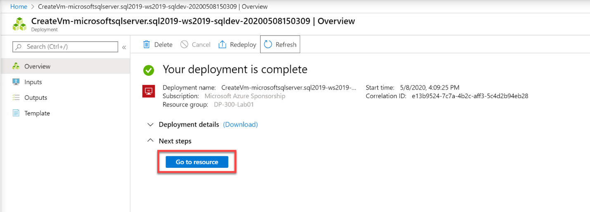

---
lab:
  title: 'Laboratorio 1: Aprovisionamiento de SQL Server en una máquina virtual de Azure'
  module: Plan and Implement Data Platform Resources
---

# Aprovisionamiento de un servidor SQL Server en una máquina virtual de Azure

**Tiempo estimado**: 30 minutos

Los alumnos explorarán Azure Portal y lo usarán para crear una máquina virtual de Azure con SQL Server 2019 instalado. A continuación, se conectarán a la máquina virtual a través del Protocolo de escritorio remoto.

Es administrador de bases de datos para AdventureWorks. Debe crear un entorno de prueba para usarlo en una prueba de concepto. La prueba de concepto usará SQL Server en una máquina virtual de Azure y una copia de seguridad de la base de datos AdventureWorksDW. Debe configurar la máquina virtual, restaurar la base de datos y consultarla para asegurarse de que está disponible.

## Implementación de SQL Server en una máquina virtual de Azure

1. En la máquina virtual del laboratorio, inicie una sesión del explorador, vaya a [https://portal.azure.com](https://portal.azure.com/) e inicie sesión con la cuenta Microsoft asociada a la suscripción de Azure.

    

1. Localice la barra de búsqueda en la parte superior de la página. Busque **Azure SQL**. Seleccione el resultado de la búsqueda de **Azure SQL** que aparece en los resultados, debajo de **Servicios**.

    

1. En la hoja **Azure SQL**, seleccione **Crear**.

    

1. En la hoja **Seleccione una opción de implementación de SQL**, abra el cuadro desplegable que aparece en **Máquinas virtuales de SQL**. Seleccione la opción etiquetada **Free SQL Server License: SQL 2019 Developer on Windows Server 2022** (Licencia gratuita de SQL Server: SQL 2019 Developer en Windows Server 2022). Seleccione **Crear**.

    

1. En la página **Crear una máquina virtual**, escriba los siguientes datos:

    - **Suscripción**: &lt;Su suscripción&gt;
    - **Grupo de recursos:** &lt;su grupo de recursos&gt;.
    - **Nombre de la máquina virtual:** azureSQLserverVM
    - **Región:** &lt;la región local, igual que la región seleccionada para el grupo de recursos&gt;
    - **Opciones de disponibilidad:** No se necesita redundancia de la infraestructura
    - **Imagen:** Licencia de SQL Server gratis: SQL 2019 Developer on Windows Server 2022 - Gen1 (Licencia gratuita de SQL Server: SQL 2019 Developer en Windows Server 2022 - Gen1)
    - **Instancia de Azure Spot:** No (desactivado)
    - **Size:** Estándar *D2s_v3* (2 vCPU, 8 GiB de memoria). Es posible que tenga que seleccionar el vínculo "Ver todos los tamaños" para ver esta opción)
    - **Nombre de usuario de la cuenta de administrador:** sqladmin
    - **Contraseña de la cuenta de administrador:** pwd!DP300lab01 (o su propia contraseña que cumpla los criterios)
    - **Seleccionar puertos de entrada:** RDP (3389)
    - **¿Quiere usar una licencia de Windows Server existente?:** No (desactivado)

    Anote el nombre de usuario y la contraseña para más adelante.

    

1. Vaya a la pestaña **Discos** y revise la configuración.

    

1. Vaya a la pestaña **Redes** y revise la configuración.

    

1. Vaya a la pestaña **Redes** y revise la configuración.

    

    Compruebe que la opción **Habilitar auto_shutdown** esté desactivada.

1. Vaya a la pestaña **Opciones avanzadas** y revise la configuración.

    

1. Vaya a la pestaña **Configuración de SQL Server** y revise la configuración.

    

    **Nota:** también puede configurar el almacenamiento de la máquina virtual con SQL Server en esta pantalla. De forma predeterminada, las plantillas de máquina virtual de Azure con SQL Server crean un disco prémium con almacenamiento en caché de lectura para los datos, un disco prémium sin almacenamiento en caché para el registro de transacciones y usa el disco SSD local (D:\ en Windows) para tempdb.

1. Seleccione el botón **Revisar y crear**. Seleccione **Crear**.

    

1. En la hoja de información general de la implementación, espere hasta que esta finalice. La máquina virtual tarda aproximadamente 5-10 minutos en implementarse. Una vez finalizada la implementación, seleccione **Ir al recurso**.

    **Nota:** La implementación puede tardar varios minutos en completarse.

    

1. En la página **Información general** de la máquina virtual, explore las opciones de menú de este recurso para revisar lo que está disponible.

    

## Conexión a SQL Server en una máquina virtual de Azure

1. En la página **Información general** de la máquina virtual, seleccione el botón **Conectar** y elija RDP.

    

1. En la pestaña RDP, seleccione el botón **Descargar archivo RDP**.

    

    **Nota:** Si observa el error **Requisito previo del puerto no cumplido**. Asegúrese de seleccionar el vínculo para agregar una regla de grupo de seguridad de red de entrada con el puerto de destino mencionado en el campo *Número de puerto*.

    

1. Abra el archivo RDP que acaba de descargar. Cuando aparezca un cuadro de diálogo en el que se le pregunte si desea conectarse, seleccione **Conectar**.

    

1. Escriba el nombre de usuario y la contraseña seleccionados durante el proceso de aprovisionamiento de máquinas virtuales. A continuación, seleccione **Aceptar**.

    

1. Cuando aparezca el cuadro de diálogo** Conexión a Escritorio remoto** en el que se le pregunta si desea conectarse, seleccione **Sí**.

    

1. Seleccione el botón Inicio de Windows y escriba SSMS. Seleccione **Microsoft SQL Server Management Studio** en la lista.  

1. Cuando se abra SSMS, observe que el cuadro de diálogo **Conectar al servidor** se rellenará previamente con el nombre de instancia predeterminado. Seleccione **Conectar**.

    

Azure Portal proporciona herramientas eficaces para administrar un servidor SQL Server hospedado en una máquina virtual. Estas herramientas incluyen el control de la aplicación de revisiones automatizada, copias de seguridad automatizadas y una forma sencilla de configurar la alta disponibilidad.
