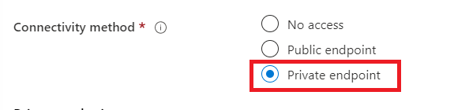
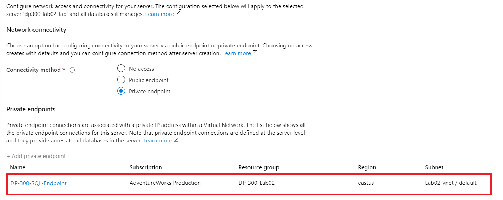
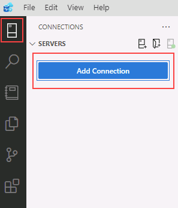
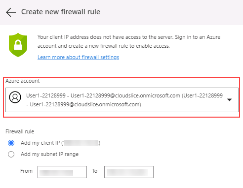

---
lab:
  title: 'Laboratorio 2: Aprovisionamiento de Azure SQL Database'
  module: Plan and Implement Data Platform Resources
---

# Aprovisionamiento de Azure SQL Database

**Tiempo estimado**: 40 minutos

Los alumnos configurarán los recursos básicos necesarios para implementar Azure SQL Database con un punto de conexión de red virtual. La conectividad con SQL Database se validará mediante Azure Data Studio desde la máquina virtual del laboratorio.

Como administrador de base de datos de AdventureWorks, configurarás una nueva base de datos SQL, incluido un punto de conexión de red virtual para aumentar y simplificar la seguridad de la implementación. Azure Data Studio se usará para evaluar el uso de un cuaderno de SQL para consultar datos y retener los resultados.

## Ve a Azure Portal

1. En la máquina virtual del laboratorio, inicia una sesión del explorador y desplázate a [https://portal.azure.com](https://portal.azure.com/). Conéctate al Portal con el **Nombre de usuario** y la **Contraseña** de Azure proporcionados en la pestaña **Recursos** de esta máquina virtual de laboratorio.

    

1. En Azure Portal, busca "grupos de recursos" en el cuadro de búsqueda de la parte superior y selecciona **Grupos de recursos** en la lista de opciones.

    

1. En la página **Grupo de recursos**, comprueba el grupo de recursos que aparece (debería empezar con *contoso-rg*), anota la **ubicación** asignada al grupo de recursos, ya que la usarás en el ejercicio siguiente.

    **Nota:** es posible que tengas asignada una ubicación diferente.

    

## Creación de una red virtual

1. En la página principal de Azure Portal, selecciona el menú izquierdo.  

    

1. En el panel de navegación izquierdo, haz clic en **Redes**  

1. Haz clic en **+ Crear** para abrir la página **Crear una red virtual**. En la pestaña **Datos básicos**, completa la siguiente información:

    - **Suscripción**: &lt;tu suscripción&gt;
    - **Grupo de recursos:** empezando por *contoso-rg*
    - **Nombre:** lab02-vnet
    - **Región:** selecciona la misma región en la que se creó el grupo de recursos

1. Haz clic en **Revisar y crear**, revisa la configuración de la nueva red virtual y, después, haz clic en **Crear**.

## Aprovisionamiento de Azure SQL Database

1. En Azure Portal, busca "Bases de datos SQL" en el cuadro de búsqueda de la parte superior y después haz clic en **Bases de datos SQL** en la lista de opciones.

    

1. En la hoja **Bases de datos SQL**, selecciona **+ Crear**.

    

1. En la página **Crear base de datos SQL**, selecciona las siguientes opciones en la pestaña **Aspectos básicos** y, después, haz clic en **Siguiente: Redes**.

    - **Suscripción**: &lt;tu suscripción&gt;
    - **Grupo de recursos:** empezando por *contoso-rg*
    - **Nombre de base de datos**: AdventureWorksLT
    - **Servidor:** haz clic en el vínculo **Crear nuevo**. Se abrirá la página del **servidor de SQL Database**. Proporciona los detalles del servidor como se indica a continuación:
        - **Nombre del servidor:** dp300-lab-&lt;tus iniciales (en minúsculas)&gt;(un nombre de servidor debe ser único globalmente)
        - **Ubicación:**&lt;la región local, igual que la región seleccionada para el grupo de recursos; de lo contrario, se puede producir un error&gt;
        - **Método de autenticación**: usa la autenticación de SQL
        - **Inicio de sesión del administrador del servidor:** dp300admin
        - **Contraseña**: dp300P@ssword!
        - **Confirmar contraseña: **dp300P@ssword!

        Tu página **Crear servidor de SQL Database** debe ser similar a la siguiente. A continuación, haz clic en **Aceptar**.

        

    -  Vuelve a la página **Crear base de datos SQL** y asegúrate de que **¿Deseas usar el grupo elástico?** está en **No**.
    -  En la opción **Proceso y almacenamiento**, haz clic en el vínculo **Configurar base de datos**. En la página **Configurar**, en el elemento desplegable **Nivel de servicio**, selecciona **Básico** y, a continuación, **Aplicar**.

    **Nota:** anota este nombre de servidor y tu información de inicio de sesión. Lo usarás laboratorios posteriores.

1. Para la opción **Redundancia de almacenamiento de copia de seguridad**, mantén el valor predeterminado: **Almacenamiento de copia de seguridad con redundancia geográfica**.

1. Luego haz clic en **Siguiente: Redes**.

1. En la pestaña **Redes**, en la opción **Conectividad de red**, haz clic en el botón de radio **Punto de conexión privado**.

    

1. Posteriormente, haz clic en el vínculo **+ Agregar un punto de conexión privado** en la opción **Puntos de conexión privados**.

    

1. Completa el panel derecho **Crear punto de conexión privado** de la siguiente manera:

    - **Suscripción**: &lt;tu suscripción&gt;
    - **Grupo de recursos:** empezando por *contoso-rg*
    - **Ubicación:**&lt;la región local, igual que la región seleccionada para el grupo de recursos; de lo contrario, se puede producir un error&gt;
    - **Nombre:** DP-300-SQL-Endpoint
    - **Recurso secundario de destino:** SqlServer
    - **Red virtual:** lab02-vnet
    - **Subred:** lab02-vnet/default (10.x.0.0/24)
    - **Integrar con la zona DNS privada**: sí
    - **Zona DNS privada:** mantén el valor predeterminado
    - Revisa la configuración y, luego, haz clic en **Aceptar**  

    

1. El nuevo punto de conexión se mostrará en la lista **Puntos de conexión privados**.

    

1. Haz clic en **Siguiente: Seguridad** y, después, en **Siguiente: Configuración adicional**.  

1. En la página **Configuración adicional**, selecciona **Ejemplo** en la opción **Usar datos existentes**. Selecciona **Aceptar** si se muestra un mensaje emergente para la base de datos de ejemplo.

    

1. Haz clic en **Revisar y crear**.

1. Revisa la configuración antes de hacer clic en **Crear**.

1. Una vez finalizada la implementación, haz clic en **Ir al recurso**.

## Habilitar el acceso a Azure SQL Database

1. En la página **SQL Database**, selecciona la sección **Información general** y, a continuación, selecciona el vínculo para el nombre del servidor en la sección superior:

    

1. En la hoja de navegación servidores SQL, selecciona **Redes** en la sección **Seguridad**.

    

1. En la pestaña **Acceso público**, selecciona **Redes seleccionadas** y, después, selecciona la propiedad **Permitir a los servicios y recursos de Azure acceder a este servidor**. Haz clic en **Guardar**.

    

## Conexión a Azure SQL Database en Azure Data Studio

1. Inicia Azure Data Studio desde la máquina virtual del laboratorio.

    - Es posible que veas este elemento emergente en el inicio inicial de Azure Data Studio. Si te aparece, haz clic en **Sí (recomendado)**  

        

1. Cuando se abra Azure Data Studio, haz clic en el botón **Conexiones** de la esquina superior izquierda y, después, en **Agregar conexión**.

    

1. En la barra lateral **Conexión**, rellene la sección **Detalles de conexión** con información de conexión para conectarte a la SQL Database creada en los pasos anteriores.

    - Tipo de conexión: **Microsoft SQL Server**
    - Servidor: escribe el nombre del SQL Server creado anteriormente. Por ejemplo: **dp300-lab-xxxxxxxx.database.windows.net** (donde "xxxxxxxx" es un número random)
    - Tipo de autenticación: **Inicio de sesión SQL**
    - Nombre de usuario: **dp300admin**
    - Contraseña: **dp300P@ssword!**
    - Expande la lista desplegable Base de datos para seleccionar **AdventureWorksLT** 
        - **NOTA:** es posible que se te pida que agregues una regla de firewall que permita el acceso IP de cliente a este servidor. Si se te pide que agregues una regla de firewall, haz clic en **Agregar cuenta** e inicia sesión en tu cuenta de Azure. En la pantalla **Crear nueva regla de firewall**, haz clic en **Aceptar**.

        

        Como alternativa, puedes crear manualmente una regla de firewall para el SQL Server en Azure Portal; para ello, ve a tu servidor SQL Server, selecciona **Redes** y, después, selecciona **+ Agregar la dirección IPv4 del cliente (tu dirección IP)**

        

    De nuevo en la barra lateral Conexión, sigue rellenando los detalles de la conexión:  

    - El grupo de servidores permanecerá en el **&lt;valor predeterminado&gt;**
    - El valor de Nombre (opcional) se puede rellenar con un nombre descriptivo de la base de datos, si se quiere.
    - Revisa la configuración y haz clic en **Conectar**  

    

1. Azure Data Studio se conectará a la base de datos y mostrará información básica acerca de la base de datos, incluida una lista parcial de objetos.

    

## Consultar Azure SQL Database con un cuaderno de SQL

1. En Azure Data Studio, conectado a la base de datos AdventureWorksLT de este laboratorio, haz clic en el botón **Nuevo cuaderno**.

    

1. Haz clic en el vínculo **+Texto** para agregar un nuevo cuadro de texto en el cuaderno.  

    

**Nota:** dentro del cuaderno, puedes insertar texto sin formato para explicar las consultas o los conjuntos de resultados.

1. Escribe el texto **Top Ten Customers by Order SubTotal**, lo puedes poner en negrita si lo deseas.

    

1. Haz clic en el botón **+ Celda** y, a después, en **Celda de código** para agregar una nueva celda de código al final del cuaderno.  

    

5. Pega la siguiente instrucción SQL en la nueva celda:

```sql
SELECT TOP 10 cust.[CustomerID], 
    cust.[CompanyName], 
    SUM(sohead.[SubTotal]) as OverallOrderSubTotal
FROM [SalesLT].[Customer] cust
    INNER JOIN [SalesLT].[SalesOrderHeader] sohead
         ON sohead.[CustomerID] = cust.[CustomerID]
GROUP BY cust.[CustomerID], cust.[CompanyName]
ORDER BY [OverallOrderSubTotal] DESC
   ```

1. Haz clic en el círculo azul con la flecha para ejecutar la consulta. Observa de qué forma los resultados se incluyen en la celda con la consulta.

1. Haz clic en el botón **+ Texto** para agregar una nueva celda de texto.

1. Escribe el texto **Top Ten Ordered Product Categories**, lo puedes poner en negrita si lo deseas.

1. Vuelve a hacer clic en **+ Código** para agregar una nueva celda y pega la siguiente instrucción SQL en la celda:

```sql
SELECT TOP 10 cat.[Name] AS ProductCategory, 
    SUM(detail.[OrderQty]) AS OrderedQuantity
FROM salesLT.[ProductCategory] cat
   INNER JOIN [SalesLT].[Product] prod
      ON prod.[ProductCategoryID] = cat.[ProductCategoryID]
   INNER JOIN [SalesLT].[SalesOrderDetail] detail
      ON detail.[ProductID] = prod.[ProductID]
GROUP BY cat.[name]
ORDER BY [OrderedQuantity] DESC
```

1. Haz clic en el círculo azul con la flecha para ejecutar la consulta.

1. Para ejecutar todas las celdas del cuaderno y presentar los resultados, haz clic en el botón **Ejecutar todo** en la barra de herramientas.

    

1. En Azure Data Studio, guarda el cuaderno en el menú Archivo (guardar o guardar como) en la ruta de acceso de **C:\Labfiles\Deploy Azure SQL Database** (crea la estructura de carpetas si no existe). Asegúrate de que la extensión de archivo es **.ipynb**

1. Cierra la pestaña del cuaderno desde Azure Data Studio. En el menú Archivo, selecciona Abrir archivo y abre el cuaderno que acabas de guardar. Observa que los resultados de la consulta se han guardado junto con las consultas en el cuaderno.

En este ejercicio, has visto cómo implementar una Azure SQL Database con un punto de conexión de red virtual. También has podido conectarte a la base de datos SQL que has creado mediante SQL Server Management Studio.
