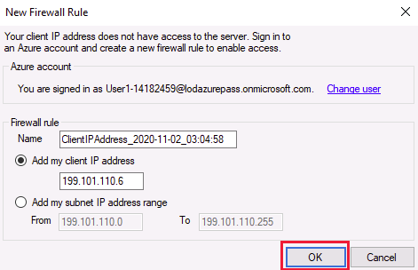
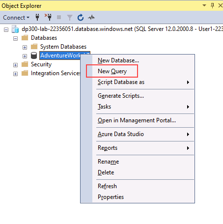

---
lab:
  title: "Laboratorio\_3: Autorización del acceso a Azure SQL Database con Azure Active Directory"
  module: Implement a Secure Environment for a Database Service
---

# Configuración de la autenticación y la autorización

**Tiempo estimado**: 20 minutos

Los alumnos tomarán la información de las lecciones para configurar y, posteriormente, implementar la seguridad en Azure Portal y dentro de la base de datos *AdventureWorks*.

Le han contratado como administrador sénior de bases de datos para garantizar la seguridad del entorno de la base de datos.

**Nota:** En estos ejercicios se le pide tanto que copie y pegue código de T-SQL como que use los recursos de SQL existentes. Comprueba que el código se ha copiado correctamente antes de ejecutar el código.

## Autorización del acceso a Azure SQL Database con Azure Active Directory

1. En la máquina virtual del laboratorio, inicia una sesión del explorador y desplázate a [https://portal.azure.com](https://portal.azure.com/). Conéctate al Portal con el **Nombre de usuario** y la **Contraseña** de Azure proporcionados en la pestaña **Recursos** de esta máquina virtual de laboratorio.

    

1. En la página principal de Azure Portal, seleccione **Todos los recursos**.

    

1. Selecciona el servidor de SQL **dp300-lab-xxxxxx**, donde **xxxxxx** es una cadena aleatoria, y selecciona **No configurado** junto a **Administrador de Active Directory**.

    

1. En la siguiente pantalla, seleccione **Establecer administrador**.

    

1. En la barra lateral de** Azure Active Directory**, busque el nombre de usuario de Azure con el que inició sesión en Azure Portal y haga clic en **Seleccionar**.

1. Seleccione **Guardar** para completar el proceso. Esto hará que el nombre de usuario sea el administrador de Azure Active Directory del servidor, como se muestra a continuación.

    

1. En la parte izquierda, seleccione **Información general** y, después, copie el **Nombre del servidor**.

    

1. Abra SQL Server Management Studio y seleccione **Conectar** > **Motor de base de datos**. En **Nombre del servidor**, pegue el nombre del servidor. Cambie el tipo de autenticación a **Azure Active Directory Universal con MFA**.

    

    En el campo **Nombre de usuario**, seleccione el **nombre de usuario** de Azure en la pestaña **Recursos**.

1. Seleccione **Conectar**.

> [!NOTE]
> Cuando intente iniciar sesión por primera vez en una base de datos de Azure SQL, la dirección IP del cliente debe agregarse al firewall. SQL Server Management Studio puede hacer esto automáticamente. Use la **contraseña** de Azure Portal en la pestaña **Recursos**, seleccione **Iniciar sesión**, elija las credenciales de Azure y, después, seleccione **Aceptar**.
> 

## Administración del acceso a objetos de base de datos

En esta tarea, administrará el acceso a la base de datos y sus objetos. Lo primero que va a hacer es crear dos usuarios en la base de datos *AdventureWorksLT*.

1. Use el **Explorador de objetos** y expanda **Bases de datos**.
1. Haga clic con el botón derecho en **AdventureWorksLT** y seleccione **Nueva consulta**.

    

1. En la ventana Nueva consulta, copie y pegue T-SQL. Ejecute la consulta para crear los dos usuarios.

    ```sql
    CREATE USER [DP300User1] WITH PASSWORD = 'Azur3Pa$$';
    GO

    CREATE USER [DP300User2] WITH PASSWORD = 'Azur3Pa$$';
    GO
    ```

    **Nota:** Estos usuarios se crean en el ámbito de la base de datos AdventureWorksLT. A continuación, creará un rol personalizado al que agregará los usuarios.

1. Ejecute la siguiente instrucción T-SQL en la misma ventana de consulta.

    ```sql
    CREATE ROLE [SalesReader];
    GO

    ALTER ROLE [SalesReader] ADD MEMBER [DP300User1];
    GO

    ALTER ROLE [SalesReader] ADD MEMBER [DP300User2];
    GO
    ```

    A continuación, cree un procedimiento almacenado en el esquema **SalesLT**.

1. Ejecute la instrucción T-SQL siguiente en la ventana de consulta.

    ```sql
    CREATE OR ALTER PROCEDURE SalesLT.DemoProc
    AS
    SELECT P.Name, Sum(SOD.LineTotal) as TotalSales ,SOH.OrderDate
    FROM SalesLT.Product P
    INNER JOIN SalesLT.SalesOrderDetail SOD on SOD.ProductID = P.ProductID
    INNER JOIN SalesLT.SalesOrderHeader SOH on SOH.SalesOrderID = SOD.SalesOrderID
    GROUP BY P.Name, SOH.OrderDate
    ORDER BY TotalSales DESC
    GO
    ```

    Luego, use la sintaxis `EXECUTE AS USER` para probar la seguridad. Esto permite que el motor de base de datos ejecute una consulta en el contexto del usuario.

1. Ejecute la siguiente instrucción T-SQL.

    ```sql
    EXECUTE AS USER = 'DP300User1'
    EXECUTE SalesLT.DemoProc
    ```

    Se producirá un error con el mensaje:

    

1. A continuación, conceda permisos al rol para que este pueda ejecutar el procedimiento de almacenamiento. Ejecute la instrucción T-SQL siguiente.

    ```sql
    REVERT;
    GRANT EXECUTE ON SCHEMA::SalesLT TO [SalesReader];
    GO
    ```

    El primer comando revierte el contexto de ejecución al propietario de la base de datos.

1. Vuelva a ejecutar la instrucción T-SQL anterior.

    ```sql
    EXECUTE AS USER = 'DP300User1'
    EXECUTE SalesLT.DemoProc
    ```

    

En este ejercicio ha visto cómo usar Azure Active Directory para conceder a las credenciales de Azure acceso a una instancia de SQL Server hospedada en Azure. También ha usado la instrucción T-SQL para crear usuarios de base de datos y les ha concedido permisos para ejecutar procedimientos almacenados.
