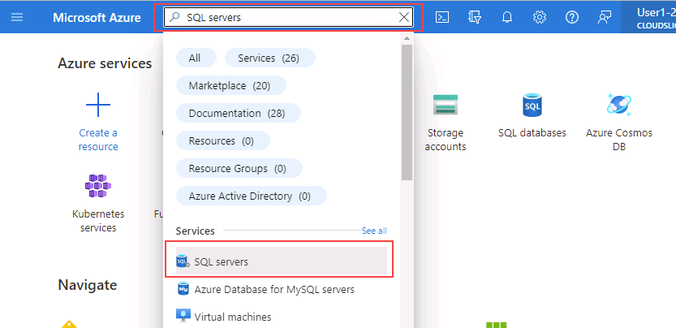
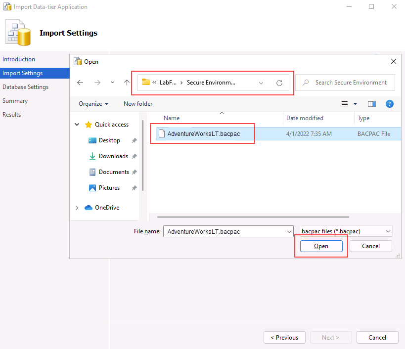

---
lab:
  title: 'Laboratorio 4: configuración de reglas de firewall de Azure SQL Database'
  module: Implement a Secure Environment for a Database Service
---

# Implementación de un entorno seguro

**Tiempo estimado: 30 minutos**

El alumnado tomará la información obtenida en las lecciones para configurar y, posteriormente, implementar la seguridad en Azure Portal y dentro de la base de datos AdventureWorks.

Te han contratado como administrador sénior de bases de datos para garantizar la seguridad del entorno de bases de datos. Estas tareas se centrarán en Azure SQL Database.

**Nota:** estos ejercicios piden copiar y pegar código T-SQL. Comprueba que el código se ha copiado correctamente antes de ejecutar el código.

## Configuración de reglas de firewall de Azure SQL Database

1. En la máquina virtual del laboratorio, inicia una sesión del explorador y desplázate a [https://portal.azure.com](https://portal.azure.com/). Conéctate al Portal con el **Nombre de usuario** y la **Contraseña** de Azure proporcionados en la pestaña **Recursos** de esta máquina virtual de laboratorio.

    

1. En Azure Portal, busca "Servidores SQL" en el cuadro de búsqueda de la parte superior y después haz clic en **Servidores SQL** en la lista de opciones.

    

1. Selecciona el nombre **dp300-lab-XXXXXXXX** que se va a llevar a la página de detalles (es posible que tenga un grupo de recursos y una ubicación diferentes asignados para el servidor SQL).

    

1. En la pantalla de detalles del servidor SQL, mueve el mouse a la derecha del nombre del servidor y selecciona el botón **Copiar al portapapeles**, como se muestra a continuación.

    

1. Selecciona **Mostrar configuración de red**.

    

1. En la página **Redes**, haz clic en **+ Agregar la dirección IPv4 del cliente (su dirección IP)** y después haz clic en **Guardar**.

    

    **Nota:** la dirección IP del cliente se especificó automáticamente. La incorporación de la dirección IP de tu cliente a la lista te permitirá conectarte a Azure SQL Database mediante SQL Server Management Studio o cualquier otra herramienta de cliente. **Toma nota de la dirección IP del cliente, la usarás más adelante.**

1. Abra SQL Server Management Studio. En el cuadro de diálogo Conectar con el servidor, pega el nombre del servidor de Azure SQL Database e inicia sesión con estas credenciales:

    - **Nombre del servidor:**&lt;_pega el nombre del servidor de Azure SQL Database aquí_&gt;
    - **Autenticación:** autenticación de SQL Server
    - **Inicio de sesión del administrador del servidor:** sqladmin
    - **Contraseña**: P@ssw0rd01

    

1. Haga clic en **Conectar**.

1. En Explorador de objetos, expande el nodo del servidor y haz clic con el botón derecho en **Bases de datos**. Haz clic en **Importar aplicación de capa de datos**.

    

1. En la primera pantalla del cuadro de diálogo **Importar aplicación de capa de datos**, selecciona **Siguiente**.

1. Descarga el archivo .bacpac ubicado en **https://github.com/MicrosoftLearning/dp-300-database-administrator/blob/master/Instructions/Templates/AdventureWorksLT.bacpac** en la ruta de acceso **C:\LabFiles\Secure Environment** en la máquina virtual del laboratorio (crea la estructura de carpetas si no existe).

1. En la pantalla **Importar configuración**, haz clic en **Examinar** y desplázate a la carpeta **C:\LabFiles\Secure Environment**, haz clic en el archivo **AdventureWorksLT.bacpac** y después, en **Abrir**. De vuelta a la pantalla **Importar aplicación de capa de datos**, haz clic en **Siguiente**.

    

    

1. En la pantalla **Configuración de base de datos**, realiza los cambios como se indica a continuación:

    - **Nombre de la base de datos:** AdventureWorksFromBacpac
    - **Edición de Microsoft Azure SQL Database**: básico

    

1. Haga clic en **Next**.

1. En la pantalla **Resumen**, haz clic en **Finalizar**. Cuando se complete la importación, verá los resultados siguientes. A continuación, haga clic en **Cerrar**.

    

1. De vuelta en SQL Server Management Studio, en el **Explorador de objetos**, expande la carpeta **Bases de datos**. A continuación, haz clic con el botón derecho en la base de datos **AdventureWorksFromBacpac** y selecciona **Nueva consulta**.

    

1. Ejecuta la siguiente consulta T-SQL; para ello, pega el texto en la ventana de consulta.
    1. **Importante:** reemplaza **000.000.000.00** por la dirección IP del cliente. Haz clic en **Ejecutar** o presiona **F5**.

    ```sql
    EXECUTE sp_set_database_firewall_rule 
            @name = N'AWFirewallRule',
            @start_ip_address = '000.000.000.00', 
            @end_ip_address = '000.000.000.00'
    ```

1. A continuación, crearás un usuario incluido en la base de datos **AdventureWorksFromBacpac**. Selecciona **Nueva consulta** y ejecuta el siguiente código T-SQL.

    ```sql
    USE [AdventureWorksFromBacpac]
    GO
    CREATE USER ContainedDemo WITH PASSWORD = 'P@ssw0rd01'
    ```

    

    **Nota:** este comando crea un usuario incluido en la base de datos **AdventureWorksFromBacpac**. Probaremos esta credencial en el paso siguiente.

1. Navega hasta el **Explorador de objetos**. Haz clic en **Conectar** y después en **Motor de base de datos**.

    

1. Intenta conectarte con las credenciales creadas en el paso anterior. Necesitarás tener a mano la siguiente información:

    - **Inicio de sesión:** ContainedDemo
    - **Contraseña**: P@ssw0rd01

     Haga clic en **Conectar**.

     Recibirás el siguiente error.

    

    **Nota:** este error se generó porque la conexión intentó iniciar sesión en la base de datos *maestra* y no en **AdventureWorksFromBacpac** donde se creó el usuario. Cambia el contexto de conexión seleccionando **Aceptar** para salir del mensaje de error y, después, selecciona **Opciones >>** en el cuadro de diálogo **Conectar**, como se muestra a continuación.

    

1. En la pestaña **Propiedades de conexión**, escribe el nombre de la base de datos **AdventureWorksFromBacpac** y después haz clic en **Conectar**.

    

1. Observa que pudiste autenticarte correctamente con el usuario **ContainedDemo**. Esta vez has iniciado sesión directamente en **AdventureWorksFromBacpac**, que es la única base de datos a la que el usuario recién creado tiene acceso.

    

En este ejercicio, has configurado reglas de firewall de base de datos y de servidor para acceder a una base de datos hospedada en Azure SQL Database. También has usado instrucciones T-SQL para crear un usuario independiente y has usado SQL Server Management Studio para comprobar el acceso.
