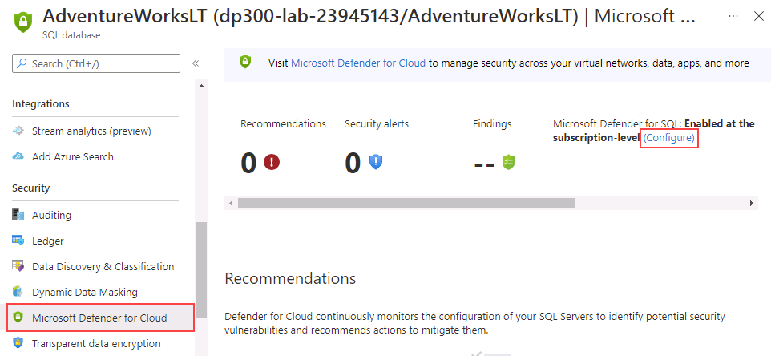

---
lab:
  title: 'Laboratorio 5: habilitación de Microsoft Defender para SQL y clasificación de datos'
  module: Implement a Secure Environment for a Database Service
---

# Habilitación de Microsoft Defender para SQL y clasificación de datos

**Tiempo estimado**: 20 minutos

El alumnado tomará la información obtenida en las lecciones para configurar y, posteriormente, implementar la seguridad en Azure Portal y dentro de la base de datos AdventureWorks.

Te han contratado como administrador sénior de bases de datos para garantizar la seguridad del entorno de bases de datos. Estas tareas se centrarán en Azure SQL Database.

**Nota:** En estos ejercicios se le pide tanto que copie y pegue código de T-SQL como que use los recursos de SQL existentes. Comprueba que el código se ha copiado correctamente antes de ejecutar el código.

## Habilitar Microsoft Defender para SQL

1. En la máquina virtual del laboratorio, inicia una sesión del explorador y desplázate a [https://portal.azure.com](https://portal.azure.com/). Conéctate al Portal con el **Nombre de usuario** y la **Contraseña** de Azure proporcionados en la pestaña **Recursos** de esta máquina virtual de laboratorio.

    

1. En Azure Portal, busca "Servidores SQL" en el cuadro de búsqueda de la parte superior y después haz clic en **Servidores SQL** en la lista de opciones.

    

1. Selecciona el nombre **dp300-lab-XXXXXXXX** que se va a llevar a la página de detalles (es posible que tenga un grupo de recursos y una ubicación diferentes asignados para el servidor SQL).

    

1. En la hoja principal del servidor de Azure SQL, vaya a la sección **Seguridad** y seleccione **Microsoft Defender for Cloud**.

    

    En la página **Microsoft Defender for Cloud**, seleccione **Enable Microsoft Defender for SQL** (Habilitar Microsoft Defender para SQL).

1. El mensaje de notificación siguiente se mostrará después de que Azure Defender for SQL esté habilitado correctamente.

    

1. En la página **Microsoft Defender for Cloud**, selecciona el vínculo **Configurar** (es posible que tengas que actualizar la página para ver esta opción).

    

1. En la página **Configuración del servidor**, observa que el modificador de alternancia en **MICROSOFT DEFENDER FOR SQL** está establecido en **ON**.

## Habilitación de la clasificación de datos

1. En la hoja principal de Azure SQL Server, desplázate a la sección **Configuración**, selecciona **Bases de datos SQL** y después selecciona el nombre de la base de datos.

    

1. En la hoja principal de la base de datos **AdventureWorksLT**, desplázate a la sección **Seguridad** y selecciona **Detección y clasificación de datos**.

    

1. En la pantalla **Detección y clasificación de datos**, verás un mensaje informativo que indica que **se está utilizando actualmente la política de protección de información de SQL y se han encontrado 15 columnas con recomendaciones de clasificación**. Seleccione este vínculo.

    

1. En la siguiente pantalla de **Data Discovery and Classification** (Detección y clasificación de datos), active la casilla situada junto a **Seleccionar todo**, seleccione **Accepted selected recommendations** (Recomendaciones seleccionadas aceptadas) y, después, seleccione **Guardar** para guardar las clasificaciones en la base de datos.

    

1. De vuelta a la pantalla **Detección y clasificación de datos**, observa que quince columnas se clasificaron correctamente en cinco tablas diferentes.

    

En este ejercicio, has mejorado la seguridad de una base de datos de Azure SQL mediante la habilitación de Microsoft Defender for SQL. También has creado columnas clasificadas en función de las recomendaciones de Azure Portal.
