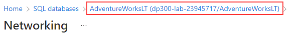
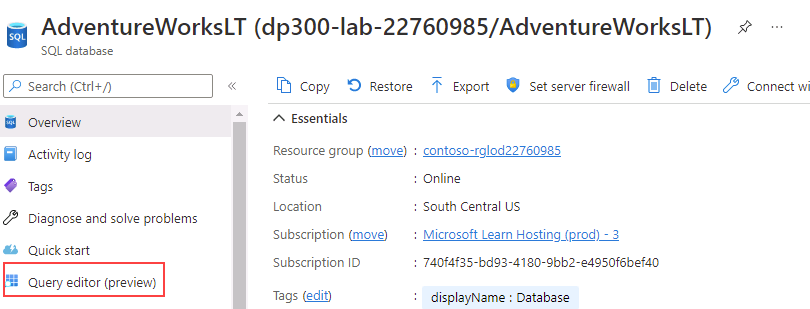
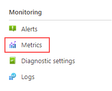

---
lab:
  title: 'Laboratorio 6: aislamiento de problemas de rendimiento mediante supervisión'
  module: Monitor and optimize operational resources in Azure SQL
---

# Aislamiento de problemas de rendimiento mediante supervisión

**Tiempo estimado: 30 minutos**

Los alumnos tomarán la información adquirida en las lecciones para definir los resultados de un proyecto de transformación digital dentro de AdventureWorks. Al examinar Azure Portal, así como otras herramientas, los alumnos determinarán cómo usar herramientas para identificar y resolver problemas relacionados con el rendimiento.

Le han contratado como administrador de bases de datos para identificar problemas relacionados con el rendimiento y proporcionar soluciones viables para resolver los problemas detectados. Debe usar Azure Portal para identificar los problemas de rendimiento y sugerir métodos para resolverlos.

**Nota:** estos ejercicios piden copiar y pegar código T-SQL. Comprueba que el código se ha copiado correctamente antes de ejecutar el código.

## Revisión del uso de la CPU en Azure Portal

1. En la máquina virtual del laboratorio, inicia una sesión del explorador y desplázate a [https://portal.azure.com](https://portal.azure.com/). Conéctate al Portal con el **Nombre de usuario** y la **Contraseña** de Azure proporcionados en la pestaña **Recursos** de esta máquina virtual de laboratorio.

    

1. En Azure Portal, busca "Servidores SQL" en el cuadro de búsqueda de la parte superior y después haz clic en **Servidores SQL** en la lista de opciones.

    

1. Selecciona el nombre **dp300-lab-XXXXXXXX** que se va a llevar a la página de detalles (es posible que tenga un grupo de recursos y una ubicación diferentes asignados para el servidor SQL).

    

1. En la hoja principal de Azure SQL Server, desplázate a la sección **Configuración**, selecciona **Bases de datos SQL** y después selecciona el nombre de la base de datos.

    

1. En la página principal de la base de datos, selecciona **Establecer firewall de servidor**.

    

1. En la página **Redes**, selecciona **+ Agregar la dirección IPv4 del cliente (su dirección IP)** y después selecciona **Guardar**.

    

1. En la navegación que hay encima de **Redes**, selecciona el vínculo que comienza con **AdventureWorksLT**.

    

1. En la barra de navegación izquierda, seleccione **Editor de consultas (versión preliminar)**.

    

    **Nota:** esta característica se encuentra en versión preliminar.

1. En **Contraseña**, escribe ** P@ssw0rd01** y selecciona **Aceptar**.

    

1. En **Consulta 1**, escribe la siguiente consulta y selecciona **Ejecutar**:

    ```sql
    DECLARE @Counter INT 
    SET @Counter=1
    WHILE ( @Counter <= 10000)
    BEGIN
        SELECT 
             RTRIM(a.Firstname) + ' ' + RTRIM(a.LastName)
            , b.AddressLine1
            , b.AddressLine2
            , RTRIM(b.City) + ', ' + RTRIM(b.StateProvince) + '  ' + RTRIM(b.PostalCode)
            , CountryRegion
            FROM SalesLT.Customer a
            INNER JOIN SalesLT.CustomerAddress c 
                ON a.CustomerID = c.CustomerID
            RIGHT OUTER JOIN SalesLT.Address b
                ON b.AddressID = c.AddressID
        ORDER BY a.LastName ASC
        SET @Counter  = @Counter  + 1
    END
    ```

    

1. Espere a que se complete la consulta.

1. En la hoja de la base de datos **AdventureWorksLT**, selecciona el icono **Métricas** en la sección **Supervisión**.

    

1. Cambia la opción de menú **Métricas** para reflejar el **porcentaje de CPU** y después selecciona una **Agregación** de **Promedio**. Se mostrará el porcentaje promedio de CPU para el período de tiempo determinado.

    

1. Observa el promedio de CPU a lo largo del tiempo. Es posible que los resultados sean ligeramente diferentes. Como alternativa, puedes ejecutar la consulta varias veces para obtener resultados más sustanciales.

    

## Identificación de consultas de consumo de CPU alto

1. Busca el icono de **Información de rendimiento de consultas** en la sección **Rendimiento inteligente** de la hoja de la base de datos **AdventureWorksLT**.

    

1. Seleccione **Restablecer la configuración**.

    

1. Haga clic en la consulta en la cuadrícula situada debajo del gráfico. Si no ve ninguna consulta, espere 2 minutos y seleccione **Actualizar**.

    **Nota:** es posible que tenga una duración y un identificador de consulta diferentes. Si ves más de una consulta, haz clic en cada una para observar los resultados.

    

Para esta consulta, puedes ver que la duración total fue superior a un minuto y que se ejecutó aproximadamente 10 000 veces.

En este ejercicio, has aprendido a explorar los recursos del servidor para una instancia de Azure SQL Database e identificar posibles problemas de rendimiento de las consultas a través de Información de rendimiento de consultas.
