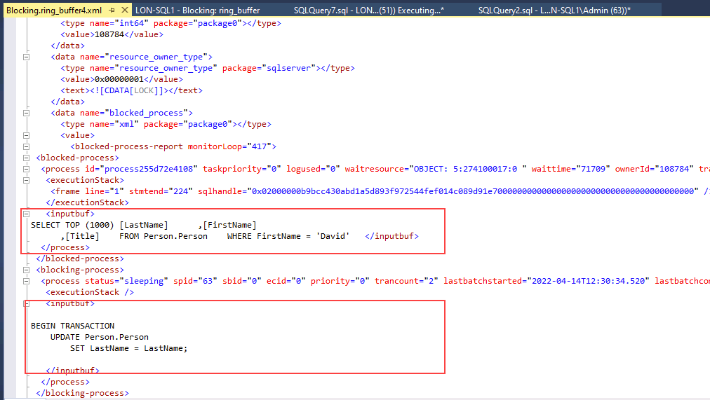

---
lab:
  title: 'Laboratorio: Identificación y resolución de problemas de bloqueo'
  module: Optimize query performance in Azure SQL
---

# Laboratorio: Identificación y resolución de problemas de bloqueo

**Tiempo estimado**: 15 minutos

Los alumnos tomarán la información adquirida en las lecciones para definir los resultados de un proyecto de transformación digital dentro de AdventureWorks. Al examinar Azure Portal, así como otras herramientas, los alumnos determinarán cómo usar herramientas nativas para identificar y resolver problemas relacionados con el rendimiento. Por último, los alumnos podrán identificar y resolver los problemas de bloqueo adecuadamente.

Le han contratado como administrador de bases de datos para identificar problemas relacionados con el rendimiento y proporcionar soluciones viables para resolver los problemas detectados. Debe investigar los problemas de rendimiento y sugerir métodos para resolverlos.

**Nota:** Estos ejercicios le piden que copie y pegue código T-SQL. Compruebe que el código se ha copiado correctamente antes de ejecutar el código.

## Restauración de una base de datos

1. Descargue el archivo de copia de seguridad de la base de datos ubicado en ****https://github.com/MicrosoftLearning/dp-300-database-administrator/blob/master/Instructions/Templates/AdventureWorks2017.bak** C:\LabFiles\Monitor y optimice** la ruta de acceso en la máquina virtual del laboratorio (cree la estructura de carpetas si no existe).

    

1. Seleccione el botón Inicio de Windows y escriba SSMS. Seleccione **Microsoft SQL Server Management Studio 18** en la lista.  

    

1. Cuando se abra SSMS, observe que el **cuadro de diálogo Conectar al** servidor se rellenará previamente con el nombre de instancia predeterminado. Seleccione **Conectar**.

    

1. Seleccione la **carpeta Bases de datos** y, a continuación **, Nueva consulta**.

    

1. En la ventana Nueva consulta, copie y pegue la instrucción T-SQL siguiente. Ejecute la consulta para restaurar la base de datos.

    ```sql
    RESTORE DATABASE AdventureWorks2017
    FROM DISK = 'C:\LabFiles\Monitor and optimize\AdventureWorks2017.bak'
    WITH RECOVERY,
          MOVE 'AdventureWorks2017' 
            TO 'C:\LabFiles\Monitor and optimize\AdventureWorks2017.mdf',
          MOVE 'AdventureWorks2017_log'
            TO 'C:\LabFiles\Monitor and optimize\AdventureWorks2017_log.ldf';
    ```

    **Nota:** El nombre y la ruta de acceso del archivo de copia de seguridad de la base de datos deben coincidir con lo que descargó en el paso 1; de lo contrario, se producirá un error en el comando.

1. Debería ver un mensaje correcto una vez completada la restauración.

    

## Ejecución de un informe de consultas bloqueadas

1. Seleccione **Nueva consulta**. Copie y pegue el código T-SQL siguiente en la ventana de consulta. Seleccione **Ejecutar** para ejecutar esta consulta.

    ```sql
    USE MASTER

    GO

    CREATE EVENT SESSION [Blocking] ON SERVER 
    ADD EVENT sqlserver.blocked_process_report(
    ACTION(sqlserver.client_app_name,sqlserver.client_hostname,sqlserver.database_id,sqlserver.database_name,sqlserver.nt_username,sqlserver.session_id,sqlserver.sql_text,sqlserver.username))
    ADD TARGET package0.ring_buffer
    WITH (MAX_MEMORY=4096 KB, EVENT_RETENTION_MODE=ALLOW_SINGLE_EVENT_LOSS, MAX_DISPATCH_LATENCY=30 SECONDS, MAX_EVENT_SIZE=0 KB,MEMORY_PARTITION_MODE=NONE, TRACK_CAUSALITY=OFF,STARTUP_STATE=ON)
    GO

    -- Start the event session 
    ALTER EVENT SESSION [Blocking] ON SERVER 
    STATE = start; 
    GO
    ```

    El código T-SQL anterior creará una sesión de evento extendido que capturará los eventos de bloqueo. Los datos contendrán los siguientes elementos:

    - Nombre de la aplicación cliente
    - Nombre de host del cliente.
    - Identificador de base de datos
    - Nombre de la base de datos
    - Nombre de usuario de NT
    - Id. de sesión
    - Texto T-SQL
    - Nombre de usuario

1. Seleccione **Nueva consulta**. Copie y pegue el código T-SQL siguiente en la ventana de consulta. Seleccione **Ejecutar** para ejecutar esta consulta.

    ```sql
    EXEC sys.sp_configure N'show advanced options', 1
    RECONFIGURE WITH OVERRIDE;
    GO
    EXEC sp_configure 'blocked process threshold (s)', 60
    RECONFIGURE WITH OVERRIDE;
    GO
    ```

    El umbral, en segundos, en el que se generan los informes de procesos bloqueados. Como resultado, no es necesario esperar hasta que el *blocked_process_report* se genere en esta lección.

1. Seleccione **Nueva consulta**. Copie y pegue el código T-SQL siguiente en la ventana de consulta. Seleccione **Ejecutar** para ejecutar esta consulta.

    ```sql
    USE AdventureWorks2017
    GO

    BEGIN TRANSACTION
        UPDATE Person.Person 
        SET LastName = LastName;

    GO
    ```

1. Para abrir otra ventana de consulta, seleccione el botón **Nueva consulta**. Copie y pegue el código T-SQL siguiente en la ventana de consulta. Seleccione **Ejecutar** para ejecutar esta consulta.

    ```sql
    USE AdventureWorks2017
    GO

    SELECT TOP (1000) [LastName]
      ,[FirstName]
      ,[Title]
    FROM Person.Person
    WHERE FirstName = 'David'
    ```

    **Nota:** esta consulta no devuelve ningún resultado y parece ejecutarse indefinidamente.

1. En el Explorador de objetos, expanda Administración, Eventos extendidos y Sesiones.

    Observe que el evento extendido denominado *Blocking* que acabamos de crear está en la lista.

    

1. Haga clic con el botón derecho en package0.ring_buffer y seleccione View Target Data (Ver datos de destino).

    

1. Seleccione el hipervínculo.

    

1. El código XML le mostrará los procesos que se están bloqueando y el proceso que causa el bloqueo. Puede ver las consultas que se ejecutaron en este proceso, así como la información del sistema.

    

1. Esta consulta también se puede usar para identificar las sesiones que bloquean otras sesiones, incluida una lista de identificadores de sesión bloqueados por identificador de sesión.

    ```sql
    WITH cteBL (session_id, blocking_these) AS 
    (SELECT s.session_id, blocking_these = x.blocking_these FROM sys.dm_exec_sessions s 
    CROSS APPLY    (SELECT isnull(convert(varchar(6), er.session_id),'') + ', '  
                    FROM sys.dm_exec_requests as er
                    WHERE er.blocking_session_id = isnull(s.session_id ,0)
                    AND er.blocking_session_id <> 0
                    FOR XML PATH('') ) AS x (blocking_these)
    )
    SELECT s.session_id, blocked_by = r.blocking_session_id, bl.blocking_these
    , batch_text = t.text, input_buffer = ib.event_info, * 
    FROM sys.dm_exec_sessions s 
    LEFT OUTER JOIN sys.dm_exec_requests r on r.session_id = s.session_id
    INNER JOIN cteBL as bl on s.session_id = bl.session_id
    OUTER APPLY sys.dm_exec_sql_text (r.sql_handle) t
    OUTER APPLY sys.dm_exec_input_buffer(s.session_id, NULL) AS ib
    WHERE blocking_these is not null or r.blocking_session_id > 0
    ORDER BY len(bl.blocking_these) desc, r.blocking_session_id desc, r.session_id;
    ```

    

1. Haga clic con el botón derecho en el evento extendido denominado **Bloqueo y seleccione **Detener sesión****.

    

1. Vuelva a la sesión de consulta que está causando el bloqueo y escriba `ROLLBACK TRANSACTION` en la línea debajo de la consulta. Resalte `ROLLBACK TRANSACTION`y seleccione **Ejecutar**.

    

1. Vuelva a la sesión de consulta que se bloqueó. Observará que ahora se ha completado la consulta.

    

## Habilitación del nivel de aislamiento de instantánea de confirmación de lectura

1. En SQL Server Management Studio, seleccione **Nueva consulta**. Copie y pegue el código T-SQL siguiente en la ventana de consulta. Seleccione en el botón **Ejecutar** para ejecutar esta consulta.

    ```sql
    USE master
    GO
    
    ALTER DATABASE AdventureWorks2017 SET READ_COMMITTED_SNAPSHOT ON WITH ROLLBACK IMMEDIATE;
    GO
    ```

1. Vuelva a ejecutar la consulta que provocó el bloqueo en un nuevo editor de consultas.

    ```sql
    USE AdventureWorks2017
    GO
    
    BEGIN TRANSACTION
        UPDATE Person.Person 
        SET LastName = LastName;
    GO
    ```

1. Vuelva a ejecutar la consulta que se bloqueó en un nuevo editor de consultas.

    ```sql
    USE AdventureWorks2017
    GO
    
    SELECT TOP (1000) [LastName]
     ,[FirstName]
     ,[Title]
    FROM Person.Person
    WHERE firstname = 'David'
    ```

    

    Tenga en cuenta que la consulta del paso 3 ahora se completa, mientras que en la tarea anterior estaba bloqueada por UPDATE.

    El aislamiento de instantánea de lectura confirmada es una forma optimista de aislamiento de transacciones y la última consulta muestra la última versión confirmada de los datos, en lugar de bloquearse.

En este ejercicio, ha aprendido a identificar las sesiones bloqueadas y a mitigar esos escenarios.
