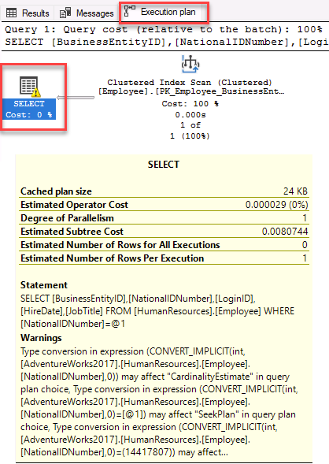

---
lab:
  title: 'Laboratorio 9: identificación de problemas de diseño de bases de datos'
  module: Optimize query performance in Azure SQL
---

# Identificación de problemas de diseño de bases de datos

**Tiempo estimado**: 15 minutos

Los alumnos tomarán la información adquirida en las lecciones para definir los resultados de un proyecto de transformación digital dentro de AdventureWorks. Al examinar Azure Portal, así como otras herramientas, los alumnos determinarán cómo usar herramientas nativas para identificar y resolver problemas relacionados con el rendimiento. Finalmente, los alumnos podrán evaluar un diseño de base de datos para los problemas con la normalización, la selección de tipos de datos y el diseño de índices.

Le han contratado como administrador de bases de datos para identificar problemas relacionados con el rendimiento y proporcionar soluciones viables para resolver los problemas detectados. AdventureWorks ha vendido bicicletas y piezas de bicicleta directamente a los consumidores y distribuidores durante más de una década. Su trabajo consiste en identificar problemas en el rendimiento de las consultas y corregirlos mediante las técnicas aprendidas en este módulo.

**Nota:** estos ejercicios piden copiar y pegar código T-SQL. Comprueba que el código se ha copiado correctamente antes de ejecutar el código.

## Restauración de una base de datos

1. Descarga el archivo de copia de seguridad de la base de datos ubicado en **https://github.com/MicrosoftLearning/dp-300-database-administrator/blob/master/Instructions/Templates/AdventureWorks2017.bak** en **C:\LabFiles\Monitor y optimiza** la ruta de acceso en la máquina virtual del laboratorio (crea la estructura de carpetas si no existe).

    

1. Selecciona el botón Inicio de Windows y escribe SSMS. Selecciona **Microsoft SQL Server Management Studio 18** en la lista.  

    

1. Cuando se abra SSMS, observa que el cuadro de diálogo **Conectar con el servidor** se rellenará previamente con el nombre de la instancia predeterminado. Seleccione **Conectar**.

    

1. Selecciona la carpeta **Bases de datos** y después **Nueva consulta**.

    

1. En la ventana Nueva consulta, copia y pega la consulta de T-SQL siguiente. Ejecuta la consulta para restaurar la base de datos.

    ```sql
    RESTORE DATABASE AdventureWorks2017
    FROM DISK = 'C:\LabFiles\Monitor and optimize\AdventureWorks2017.bak'
    WITH RECOVERY,
          MOVE 'AdventureWorks2017' 
            TO 'C:\LabFiles\Monitor and optimize\AdventureWorks2017.mdf',
          MOVE 'AdventureWorks2017_log'
            TO 'C:\LabFiles\Monitor and optimize\AdventureWorks2017_log.ldf';
    ```

    **Nota:** el nombre y la ruta de acceso del archivo de copia de seguridad de la base de datos deben coincidir con lo descargado en el paso 1; de lo contrario, se producirá un error en el comando.

1. Debería aparecer un mensaje de operación correcta una vez completada la restauración.

    

## Examen de la consulta e identificación del problema

1. Seleccione **Nueva consulta**. Copie y pegue el código T-SQL siguiente en la ventana de consulta. Seleccione **Ejecutar** para ejecutar esta consulta.

    ```sql
    USE AdventureWorks2017
    GO
    
    SELECT BusinessEntityID, NationalIDNumber, LoginID, HireDate, JobTitle
    FROM HumanResources.Employee
    WHERE NationalIDNumber = 14417807;
    ```

1. Antes de ejecutar la consulta, selecciona el icono **Incluir plan de ejecución real** o presiona **CTRL+M**. Esto hará que se muestre el plan de ejecución al ejecutar la consulta. Seleccione **Ejecutar** para ejecutar esta consulta.

    

1. Para ir al plan de ejecución, selecciona la pestaña **Plan de ejecución** en el panel de resultados. En el plan de ejecución, pasa el mouse por encima del operador `SELECT`. Verás un mensaje de advertencia que se identifica con un signo de exclamación en un triángulo amarillo, tal como se muestra a continuación. Identifica lo que le indica el mensaje de advertencia.

    

## Identificación de maneras de corregir el mensaje de advertencia

La estructura de la tabla *[HumanResources].[Employee]* se muestra en la instrucción del lenguaje de definición de datos (DDL) siguiente. Revise los campos que se usan en la consulta SQL anterior en este DDL y preste atención a los tipos.

```sql
CREATE TABLE [HumanResources].[Employee](
     [BusinessEntityID] [int] NOT NULL,
     [NationalIDNumber] [nvarchar](15) NOT NULL,
     [LoginID] [nvarchar](256) NOT NULL,
     [OrganizationNode] [hierarchyid] NULL,
     [OrganizationLevel] AS ([OrganizationNode].[GetLevel]()),
     [JobTitle] [nvarchar](50) NOT NULL,
     [BirthDate] [date] NOT NULL,
     [MaritalStatus] [nchar](1) NOT NULL,
     [Gender] [nchar](1) NOT NULL,
     [HireDate] [date] NOT NULL,
     [SalariedFlag] [dbo].[Flag] NOT NULL,
     [VacationHours] [smallint] NOT NULL,
     [SickLeaveHours] [smallint] NOT NULL,
     [CurrentFlag] [dbo].[Flag] NOT NULL,
     [rowguid] [uniqueidentifier] ROWGUIDCOL NOT NULL,
     [ModifiedDate] [datetime] NOT NULL
) ON [PRIMARY]
```

1. Según el mensaje de advertencia presentado en el plan de ejecución, ¿qué cambio recomendarías?

    1. Identifique qué campo causa la conversión implícita y por qué. 
    1. Si revisa la consulta:

        ```sql
        SELECT BusinessEntityID, NationalIDNumber, LoginID, HireDate, JobTitle
        FROM HumanResources.Employee
        WHERE NationalIDNumber = 14417807;
        ```

        Notarás que el valor comparado con la columna *NationalIDNumber* de la cláusula `WHERE` se compara como un número, ya que **14417807** no está en una cadena entre comillas. 

        Después de examinar la estructura de la tabla, verás que la columna *NationalIDNumber* usa el tipo de datos `NVARCHAR` y no un tipo de datos `INT`. Esta incoherencia hace que el optimizador de la base de datos convierta de manera implícita el número en un tipo `NVARCHAR`, lo que genera una sobrecarga adicional en el rendimiento de la consulta mediante la creación de un plan poco óptimo.

Hay dos enfoques que se pueden implementar para corregir la advertencia de conversión implícita. Investigaremos cada uno de ellos en los pasos siguientes.

### Cambio del código

1. ¿Cómo cambiarías el código para resolver la conversión implícita? Cambia el código y vuelve a ejecutar la consulta.

    No olvides activar la opción **Incluir plan de ejecución real** (**CTRL+M**) si todavía no está activada. 

    En este escenario, si solo se agrega una comilla simple a cada lado del valor, lo transforma de número a formato de caracteres. Mantenga abierta la ventana de consulta de esta consulta.

    Ejecute la consulta SQL actualizada:

    ```sql
    SELECT BusinessEntityID, NationalIDNumber, LoginID, HireDate, JobTitle
    FROM HumanResources.Employee
    WHERE NationalIDNumber = '14417807';
    ```

    

    **Nota:** la advertencia desaparece y el plan de consulta se ha mejorado. Al cambiar la cláusula `WHERE` para que el valor comparado con la columna *NationalIDNumber* coincida con el tipo de datos de la columna de la tabla, el optimizador puede deshacerse de la conversión implícita.

### Cambio del tipo de datos

1. También podemos corregir la advertencia de conversión implícita cambiando la estructura de la tabla.

    Para intentar corregir el índice, copie y pegue la consulta siguiente en una ventana de consulta nueva para cambiar el tipo de datos de la columna. Intente ejecutar la consulta. Para ello, seleccione **Ejecutar** o presione <kbd>F5</kbd>.

    ```sql
    ALTER TABLE [HumanResources].[Employee] ALTER COLUMN [NationalIDNumber] INT NOT NULL;
    ```

    Cambiar el tipo de datos de columna *NationalIDNumber* por INT resolvería el problema de conversión. Sin embargo, este cambio genera otro problema que debe resolver como administrador de bases de datos.

    

    Como la columna *NationalIDNumber* forma parte de un índice no agrupado existente, es necesario volver a crear el índice para cambiar el tipo de datos. **Esto podría provocar un tiempo de inactividad prolongado en la producción, lo que resalta la importancia de elegir los tipos de datos correctos en el diseño.**

1. Para resolver este problema, copie y pegue el código siguiente en la ventana de consulta y seleccione **Ejecutar** para ejecutarlo.

    ```sql
    USE AdventureWorks2017
    GO
    
    --Dropping the index first
    DROP INDEX [AK_Employee_NationalIDNumber] ON [HumanResources].[Employee]
    GO

    --Changing the column data type to resolve the implicit conversion warning
    ALTER TABLE [HumanResources].[Employee] ALTER COLUMN [NationalIDNumber] INT NOT NULL;
    GO

    --Recreating the index
    CREATE UNIQUE NONCLUSTERED INDEX [AK_Employee_NationalIDNumber] ON [HumanResources].[Employee]( [NationalIDNumber] ASC );
    GO
    ```

1. Como alternativa, puedes ejecutar la consulta siguiente para confirmar que el tipo de datos se cambió correctamente.

    ```sql
    SELECT c.name, t.name
    FROM sys.all_columns c INNER JOIN sys.types t
        ON (c.system_type_id = t.user_type_id)
    WHERE OBJECT_ID('[HumanResources].[Employee]') = c.object_id
        AND c.name = 'NationalIDNumber'
    ```
    
    
    
1. Ahora vamos a comprobar el plan de ejecución. Vuelva a ejecutar la consulta original sin las comillas.

    ```sql
    USE AdventureWorks2017
    GO

    SELECT BusinessEntityID, NationalIDNumber, LoginID, HireDate, JobTitle
    FROM HumanResources.Employee
    WHERE NationalIDNumber = 14417807;
    ```

    

    Examina el plan de consulta y ten en cuenta que ahora puedes usar un entero para filtrar por *NationalIDNumber* sin la advertencia de conversión implícita. Ahora, el optimizador de consultas de SQL puede generar y ejecutar el plan más óptimo.

En este ejercicio, has aprendido a identificar problemas de consulta causados por conversiones implícitas de tipos de datos y a corregirlos para mejorar el plan de consulta.
