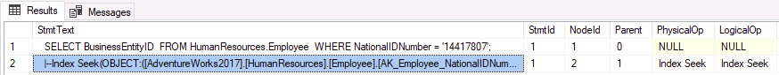
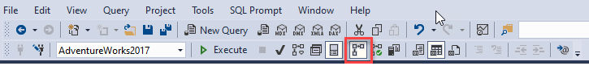

---
lab:
  title: 'Laboratorio: Aislamiento de áreas problemáticas en consultas de rendimiento deficiente en SQL Database'
  module: Optimize query performance in Azure SQL
---

# Laboratorio: Aislamiento de áreas problemáticas en consultas de rendimiento deficiente en SQL Database

**Tiempo estimado**: 20 minutos

Le han contratado como administrador de bases de datos senior para ayudar con problemas de rendimiento que ocurren actualmente cuando los usuarios consultan la base de datos AdventureWorks2017. Su trabajo consiste en identificar problemas en el rendimiento de las consultas y corregirlos mediante las técnicas aprendidas en este módulo.

Ejecutará consultas con un rendimiento por debajo del nivel óptimo, examinará los planes de consulta e intentará realizar mejoras en la base de datos AdventureWorks2017.

**Nota:** Estos ejercicios le piden que copie y pegue código T-SQL. Compruebe que el código se ha copiado correctamente antes de ejecutar el código.

## Restauración de una base de datos

1. Descargue el archivo de copia de seguridad de la base de datos ubicado en ****https://github.com/MicrosoftLearning/dp-300-database-administrator/blob/master/Instructions/Templates/AdventureWorks2017.bak** C:\LabFiles\Monitor y optimice** la ruta de acceso en la máquina virtual del laboratorio (cree la estructura de carpetas si no existe).

    

1. Seleccione el botón Inicio de Windows y escriba SSMS. Seleccione **Microsoft SQL Server Management Studio 18** en la lista.  

    

1. Cuando se abra SSMS, observe que el **cuadro de diálogo Conectar al** servidor se rellenará previamente con el nombre de instancia predeterminado. Seleccione **Conectar**.

    

1. Seleccione la **carpeta Bases de datos** y, a continuación **, Nueva consulta**.

    

1. En la ventana Nueva consulta, copie y pegue la instrucción T-SQL siguiente. Ejecute la consulta para restaurar la base de datos.

    ```sql
    RESTORE DATABASE AdventureWorks2017
    FROM DISK = 'C:\LabFiles\Monitor and optimize\AdventureWorks2017.bak'
    WITH RECOVERY,
          MOVE 'AdventureWorks2017' 
            TO 'C:\LabFiles\Monitor and optimize\AdventureWorks2017.mdf',
          MOVE 'AdventureWorks2017_log'
            TO 'C:\LabFiles\Monitor and optimize\AdventureWorks2017_log.ldf';
    ```

    **Nota:** El nombre y la ruta de acceso del archivo de copia de seguridad de la base de datos deben coincidir con lo que descargó en el paso 1; de lo contrario, se producirá un error en el comando.

1. Debería ver un mensaje correcto una vez completada la restauración.

    

## Generación del plan de ejecución real

Hay varias maneras de generar un plan de ejecución en SQL Server Management Studio.

1. Seleccione **Nueva consulta**. Copie y pegue el código T-SQL siguiente en la ventana de consulta. Seleccione **Ejecutar** para ejecutar esta consulta.

    Use la opción SHOWPLAN_ALL para ver una versión en texto del plan de ejecución de una consulta en el panel de resultados, en lugar de hacerlo de forma gráfica en una pestaña independiente.

    ```sql
    USE AdventureWorks2017;
    GO

    SET SHOWPLAN_ALL ON;
    GO

    SELECT BusinessEntityID
    FROM HumanResources.Employee
    WHERE NationalIDNumber = '14417807';
    GO

    SET SHOWPLAN_ALL OFF;
    GO
    ```

    En los resultados verá una versión en texto del plan de ejecución, en lugar de los resultados de la ejecución de la instrucción **SELECT**.

    

1. Dedique un momento a examinar el texto de la segunda fila de la **columna StmtText** :

    ```console
    |--Index Seek(OBJECT:([AdventureWorks2017].[HumanResources].[Employee].[AK_Employee_NationalIDNumber]), SEEK:([AdventureWorks2017].[HumanResources].[Employee].[NationalIDNumber]=CONVERT_IMPLICIT(nvarchar(4000),[@1],0)) ORDERED FORWARD)
    ```

    En el texto anterior se explica que el plan de ejecución usa Index Seek en la clave AK_Employee_NationalIDNumber. También muestra que el plan de ejecución tuvo que realizar un paso CONVERT_IMPLICIT.

    El optimizador de consultas pudo localizar un índice adecuado para capturar los registros necesarios.

## Resolución de un plan de consulta poco óptimo

1. Copie el código siguiente y péguelo en una ventana de nueva consulta.

    Seleccione el icono **Incluir plan de ejecución real** como se muestra a continuación antes de ejecutar la consulta o presione <kbd>CTRL</kbd>+<kbd>M</kbd>. Para ejecutar la consulta, seleccione **Ejecutar** o presione <kbd>F5</kbd>. Anote el plan de ejecución y las lecturas lógicas de la pestaña Mensajes.

    ```sql
    SET STATISTICS IO, TIME ON;

    SELECT [SalesOrderID] ,[CarrierTrackingNumber] ,[OrderQty] ,[ProductID], [UnitPrice] ,[ModifiedDate]
    FROM [AdventureWorks2017].[Sales].[SalesOrderDetail]
    WHERE [ModifiedDate] > '2012/01/01' AND [ProductID] = 772;
    ```

    

    Al revisar el plan de ejecución, notará que hay una búsqueda de claves. Si mantiene el puntero sobre el icono, verá que las propiedades indican que se realiza para cada fila que recupera la consulta. Puede ver que el plan de ejecución está realizando una operación de búsqueda de claves.

    

    Anote las columnas de la **sección Lista** de resultados. ¿Cómo mejoraría esta consulta?

    Para identificar qué índice se debe modificar para quitar la búsqueda de claves, debe examinar Index Seek sobre ella. Mantenga el puntero sobre el operador Index Seek y aparecerán las propiedades del operador.

    

1. Las búsquedas de claves se pueden quitar agregando un índice de cobertura que incluya todos los campos devueltos o buscados en la consulta. En este ejemplo, el índice solo usa ProductID. Corrija la búsqueda de claves y vuelva a ejecutar la consulta para ver el nuevo plan.

    ```sql
    CREATE NONCLUSTERED INDEX [IX_SalesOrderDetail_ProductID] ON [Sales].[SalesOrderDetail]
    ([ProductID] ASC)
    ```

    Si agregamos los campos de la lista de salida al índice como columnas incluidas, se quitará la búsqueda de claves. Puesto que el índice ya existe, debe quitarlo y volver a crearlo, o bien establecer **DROP_EXISTING=ON** para agregar las columnas. Tenga en cuenta que **ProductID** ya forma parte del índice y no es necesario agregarlo como columna incluida. Hay otra mejora de rendimiento que se puede hacer en el índice si se agrega **ModifiedDate**.

    ```sql
    CREATE NONCLUSTERED INDEX [IX_SalesOrderDetail_ProductID]
    ON [Sales].[SalesOrderDetail] ([ProductID],[ModifiedDate])
    INCLUDE ([CarrierTrackingNumber],[OrderQty],[UnitPrice])
    WITH (DROP_EXISTING = on);
    GO
    ```

1. Vuelva a ejecutar la consulta desde el paso 1. Tome nota de los cambios en las lecturas lógicas y los cambios en el plan de ejecución. El plan ahora solo necesita usar el índice no agrupado.

    

## Uso del Almacén de consultas para detectar y controlar la regresión

A continuación, ejecutará una carga de trabajo para generar estadísticas de consultas para el Almacén de consultas, examinará las Consultas que más recursos consumen para identificar rendimientos deficientes, y verá cómo forzar un mejor plan de ejecución.

1. Seleccione **Nueva consulta**. Copie y pegue el código T-SQL siguiente en la ventana de consulta. Seleccione **Ejecutar** para ejecutar esta consulta.

    Este script habilitará el Almacén de consultas para AdventureWorks2017 y establecerá la base de datos en el nivel de compatibilidad 100.

    ```sql
    USE [master];
    GO

    ALTER DATABASE [AdventureWorks2017] SET QUERY_STORE = ON;
    GO

    ALTER DATABASE [AdventureWorks2017] SET QUERY_STORE (OPERATION_MODE = READ_WRITE);
    GO

    ALTER DATABASE [AdventureWorks2017] SET COMPATIBILITY_LEVEL = 100;
    GO
    ```

    Cambiar el nivel de compatibilidad es como hacer retroceder la base de datos en el tiempo. Restringe las características que SQL Server puede usar a aquellas disponibles en SQL Server 2008.

1. Descargue el script de T-SQL ubicado en ****https://github.com/MicrosoftLearning/dp-300-database-administrator/blob/master/Instructions/Templates/CreateRandomWorkloadGenerator.sql** C:\LabFiles\Monitor y optimice** la ruta de acceso en la máquina virtual del laboratorio.

1. Descargue el script de T-SQL ubicado en ****https://github.com/MicrosoftLearning/dp-300-database-administrator/blob/master/Instructions/Templates/ExecuteRandomWorkload.sql** C:\LabFiles\Monitor y optimice** la ruta de acceso en la máquina virtual del laboratorio.

1. Seleccione el menú **Archivo** > **Abrir** > **Archivo** en SQL Server Management Studio.

1. Vaya al **archivo C:\LabFiles\Monitor y optimize\CreateRandomWorkloadGenerator.sql** .

1. Una vez abierto en SQL Server Management Studio, seleccione **Ejecutar** o presione <kbd>F5</kbd> para ejecutar la consulta.

1. En un nuevo editor de consultas, abra el archivo **C:\LabFiles\Monitor y optimize\ExecuteRandomWorkload.sql** y seleccione **Ejecutar** o presione <kbd>F5</kbd> para ejecutar la consulta.

1. Una vez finalizada la ejecución, ejecute el script una segunda vez para crear una carga adicional en el servidor. Deje abierta la pestaña de consulta para esta consulta.

1. Copie el código siguiente y péguelo en una ventana de nueva consulta y, para ejecutarlo, seleccione **Ejecutar** o presione <kbd>F5</kbd>. 

    Este script cambia el modo de compatibilidad de la base de datos con el siguiente script a SQL Server 2019 (**150**). Esto hace que todas las características y mejoras de la base de datos desde SQL Server 2008 estén disponibles para el servidor.

    ```sql
    USE [master];
    GO

    ALTER DATABASE [AdventureWorks2017] SET COMPATIBILITY_LEVEL = 150;
    GO
    ```

1. Vuelva a la pestaña de consulta desde **el archivo ExecuteRandomWorkload.sql** y vuelva a ejecutarlo.

## Examen del informe de las consultas que más recursos consumen

1. Para ver el nodo del Almacén de consultas, deberá actualizar la base de datos AdventureWorks2017 en Management Studio. Haga clic con el botón derecho en nombre de la base de datos y elija Actualizar. Verá el nodo del Almacén de consultas en la base de datos.

    

1. Expanda el nodo **Almacén de consultas** para ver todos los informes disponibles. Seleccione el informe **Consultas que más recursos consumen**.

    

1. El informe se abrirá tal y como se muestra a continuación. A la derecha, seleccione el menú desplegable y, a continuación, seleccione **Configurar**.

    

1. En la pantalla de configuración, cambie el filtro para el número mínimo de planes de consulta a 2. Después, seleccione **Aceptar**.

    

1. Elija la consulta de mayor duración; para ello, seleccione la barra situada más a la izquierda en el gráfico de barras en la parte superior izquierda del informe.

    

    ‎Esto le mostrará la consulta y el resumen del plan para la consulta de mayor duración en el Almacén de consultas.

## Forzado de un mejor plan de ejecución

1. Vaya a la parte del informe donde se encuentra el resumen del plan, como se muestra a continuación. Observará que hay dos planes de ejecución con duraciones muy diferentes.

    

1. Seleccione el identificador del plan con la menor duración (esto se indica mediante una posición inferior en el eje Y del gráfico) en la ventana superior derecha del informe. En el gráfico anterior, es PlanID 43. Seleccione el identificador del plan situado junto al gráfico de resumen del plan (tiene que estar resaltado como en la captura de pantalla anterior).

1. Seleccione **Forzar plan** en el gráfico del resumen. Aparecerá una ventana de confirmación, seleccione **Sí**.

    

    Una vez que lo haya forzado, verá que el plan forzado ahora está atenuado, y el plan de la ventana Resumen del plan ahora tiene una marca de verificación que indica que se ha forzado.

    Puede haber ocasiones en las que el optimizador de consultas elija de forma deficiente el plan de ejecución que se va a usar. Cuando esto suceda, puede forzar SQL Server para que use el plan que quiera cuando sepa que funcionará mejor.

## Uso de sugerencias de consulta para influir en el rendimiento

A continuación, ejecutará una carga de trabajo, cambiará la consulta para usar un parámetro, y aplicará la sugerencia de consulta a la consulta para optimizar un valor y volver a ejecutarla.

Antes de continuar con el ejercicio, cierre todas las ventanas de consulta actuales seleccionando el menú **Ventana** y, a continuación, seleccione **Cerrar todos los documentos**. En la ventana emergente, seleccione **No**.

1. Seleccione Nueva consulta y luego el icono **Incluir plan de ejecución real** antes de ejecutar la consulta o use **CTRL**M.

    

1. Ejecute la consulta siguiente. Tenga en cuenta que el plan de ejecución muestra un operador Index Seek.

    ```sql
    USE AdventureWorks2017;
    GO

    SELECT SalesOrderId, OrderDate
    FROM Sales.SalesOrderHeader
    WHERE SalesPersonID=288;
    ```

    

1. En una nueva ventana de consulta, ejecute la siguiente consulta. Comparación de los planes de ejecución

    ```sql
    USE AdventureWorks2017;
    GO

    SELECT SalesOrderId, OrderDate
    FROM Sales.SalesOrderHeader
    WHERE SalesPersonID=277;
    ```

    El único cambio esta vez es que el valor de SalesPersonID se ha establecido en 277. Tenga en cuenta la operación Clustered Index Scan en el plan de ejecución.

    

En función de las estadísticas del índice, el optimizador de consultas ha elegido otro plan de ejecución debido a los distintos valores de la cláusula WHERE.

¿Por qué tenemos planes diferentes si solo cambiamos el *valor SalesPersonID* ?

Dado que esta consulta usa una constante en su cláusula WHERE, el optimizador ve cada una de estas consultas como únicas y genera un plan de ejecución diferente cada vez.

## Cambio de consulta para usar una variable y usar una sugerencia de consulta

1. Cambie la consulta para usar un valor variable para SalesPersonID.

1. Use la instrucción **DECLARE** de T-SQL para declarar <strong>@SalesPersonID</strong>, de modo que pueda pasar un valor en lugar de codificar de forma rígida el valor en la cláusula **WHERE**. Debe asegurarse de que el tipo de datos de la variable coincide con el tipo de datos de la columna en la tabla de destino.

    ```sql
    USE AdventureWorks2017;
    GO

    SET STATISTICS IO, TIME ON;

    DECLARE @SalesPersonID INT;

    SELECT @SalesPersonID = 288;

    SELECT SalesOrderId, OrderDate
    FROM Sales.SalesOrderHeader
    WHERE SalesPersonID= @SalesPersonID;
    ```

    Si examina el plan de ejecución, notará que usa una operación Index Scan para obtener los resultados. El optimizador de consultas no pudo realizar buenas optimizaciones porque no puede conocer el valor de la variable local hasta el tiempo de ejecución.

1. Para ayudar a que el optimizador de consultas tome mejores decisiones, puede indicar una sugerencia de consulta. Vuelva a ejecutar la consulta anterior con `OPTION (RECOMPILE)`:

    ```sql
    USE AdventureWorks2017
    GO

    SET STATISTICS IO, TIME ON;

    DECLARE @SalesPersonID INT;

    SELECT @SalesPersonID = 288;

    SELECT SalesOrderId, OrderDate
    FROM Sales.SalesOrderHeader
    WHERE SalesPersonID= @SalesPersonID
    OPTION (RECOMPILE);
    ```

    Tenga en cuenta que el optimizador de consultas ha podido elegir un plan de ejecución más eficaz. La opción RECOMPILE hace que el compilador de consultas reemplace la variable por su valor.

    En la pestaña Mensajes puede ver que la diferencia entre lecturas lógicas es de un 68 % (689 frente a 409) más para la consulta sin la sugerencia de consulta.

En este ejercicio, ha aprendido a identificar problemas de consulta y a corregirlo para mejorar el plan de consulta.
