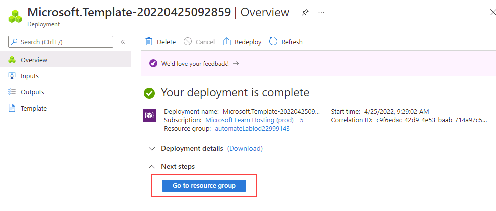

---
lab:
  title: 'Laboratorio 11: implementación de Azure SQL Database mediante la plantilla de Azure Resource Manager'
  module: Automate database tasks for Azure SQL
---

# Implementación de una base de datos de Azure SQL desde una plantilla

**Tiempo estimado**: 15 minutos

Le han contratado como ingeniero sénior de datos para ayudar a automatizar las operaciones cotidianas de administración de bases de datos. Esta automatización es para ayudar a garantizar que las bases de datos de AdventureWorks sigan funcionando a un rendimiento máximo y proporcionen métodos para alertas basadas en determinados criterios. AdventureWorks usa SQL Server en las ofertas de infraestructura como servicio (IaaS) y plataforma como servicio (PaaS).

## Exploración de la plantilla de Azure Resource Manager

1. En Microsoft Edge, abra una nueva pestaña y vaya a la siguiente ruta de acceso de un repositorio de GitHub que contiene una plantilla de ARM para implementar un recurso de SQL Database.

    ```url
    https://github.com/Azure/azure-quickstart-templates/tree/master/quickstarts/microsoft.sql/sql-database
    ```

1. Haz clic con el botón derecho en **azuredeploy.json** y selecciona **Abrir vínculo en una pestaña nueva** para ver la plantilla de ARM, que debe tener un aspecto similar al siguiente:

    ```JSON
    {
    "$schema": "https://schema.management.azure.com/schemas/2019-04-01/deploymentTemplate.json#",
    "contentVersion": "1.0.0.0",
    "parameters": {
        "serverName": {
        "type": "string",
        "defaultValue": "[uniqueString('sql', resourceGroup().id)]",
        "metadata": {
            "description": "The name of the SQL logical server."
        }
        },
        "sqlDBName": {
        "type": "string",
        "defaultValue": "SampleDB",
        "metadata": {
            "description": "The name of the SQL Database."
        }
        },
        "location": {
        "type": "string",
        "defaultValue": "[resourceGroup().location]",
        "metadata": {
            "description": "Location for all resources."
        }
        },
        "administratorLogin": {
        "type": "string",
        "metadata": {
            "description": "The administrator username of the SQL logical server."
        }
        },
        "administratorLoginPassword": {
        "type": "securestring",
        "metadata": {
            "description": "The administrator password of the SQL logical server."
        }
        }
    },
    "variables": {},
    "resources": [
        {
        "type": "Microsoft.Sql/servers",
        "apiVersion": "2020-02-02-preview",
        "name": "[parameters('serverName')]",
        "location": "[parameters('location')]",
        "properties": {
            "administratorLogin": "[parameters('administratorLogin')]",
            "administratorLoginPassword": "[parameters('administratorLoginPassword')]"
        },
        "resources": [
            {
            "type": "databases",
            "apiVersion": "2020-08-01-preview",
            "name": "[parameters('sqlDBName')]",
            "location": "[parameters('location')]",
            "sku": {
                "name": "Standard",
                "tier": "Standard"
            },
            "dependsOn": [
                "[resourceId('Microsoft.Sql/servers', concat(parameters('serverName')))]"
            ]
            }
        ]
        }
    ]
    }
    ```

1. Revisa y observa las propiedades JSON.

1. Cierre la pestaña **azuredeploy.json** y vuelva a la pestaña que contiene la carpeta de GitHub **sql-database**. Desplázate hacia abajo y selecciona **Implementar en Azure**.

    

1. La página de la plantilla de inicio rápido **Crear un servidor y una base de datos de SQL** se abrirá en Azure Portal, con detalles de recursos rellenados parcialmente desde la plantilla de ARM. Completa los campos vacíos con la siguiente información:

    - **Grupo de recursos:** empezando por *contoso-rg*
    - **Inicio de sesión de administrador de SQL:** labadmin
    - **Contraseña de inicio de sesión de administrador de SQL:** &lt;escribe una contraseña segura&gt;

1. Seleccione **Revisar y crear** y, luego, **Crear**. La implementación tardará unos 5 minutos en completarse.

    

1. Una vez finalizada, seleccione **Ir al grupo de recursos**. Se te llevará al grupo de recursos de Azure, que contiene un recurso de **SQL Server** de nombre aleatorio creado por la implementación.

    

---

## Recursos de limpieza

Si no usas Azure SQL Server para ningún otro propósito, puedes limpiar los recursos que creaste en este laboratorio.

### Eliminar el grupo de recursos

Si creaste un nuevo grupo de recursos para este laboratorio, puedes eliminar el grupo de recursos para quitar todos los recursos creados en este laboratorio.

1. En Azure Portal, selecciona **Grupos de recursos** en el panel de navegación izquierdo o busca **Grupos de recursos** en la barra de búsqueda y selecciónalo desde los resultados.

1. Ve al grupo de recursos que creaste para este laboratorio. El grupo de recursos contendrá Azure SQL Server y otros recursos creados en este laboratorio.

1. Seleccione **Eliminar grupo de recursos** del menú superior.

1. En el panel **Eliminar un grupo de recursos**, escribe el nombre del grupo de recursos para confirmarlo y selecciona **Eliminar**.

1. Espera a que se elimine el grupo de recursos.

1. Cierra Azure Portal.

### Eliminar solo los recursos del laboratorio

Si no creaste ningún grupo de recursos nuevo para este laboratorio y deseas dejar intacto el grupo de recursos y sus recursos anteriores, aún puedes eliminar los recursos creados en este laboratorio.

1. En Azure Portal, selecciona **Grupos de recursos** en el panel de navegación izquierdo o busca **Grupos de recursos** en la barra de búsqueda y selecciónalo desde los resultados.

1. Ve al grupo de recursos que creaste para este laboratorio. El grupo de recursos contendrá Azure SQL Server y otros recursos creados en este laboratorio.

1. Selecciona todos los recursos con el prefijo del nombre de SQL Server que especificaste anteriormente en el laboratorio.

1. Seleccione **Eliminar** en el menú superior.

1. En el cuadro de diálogo **Eliminar recursos**, escribe **delete** y selecciona **Eliminar**.

1. Para confirmar la eliminación, escribe el nombre del recurso y selecciona **Eliminar**.

1. Espera a que se eliminen los recursos.

1. Cierra Azure Portal.

---

Completaste correctamente este laboratorio.

Acabas de ver cómo, con un solo clic en un vínculo de plantilla de Azure Resource Manager, puedes crear una base de datos y un servidor de Azure SQL Server fácilmente.
