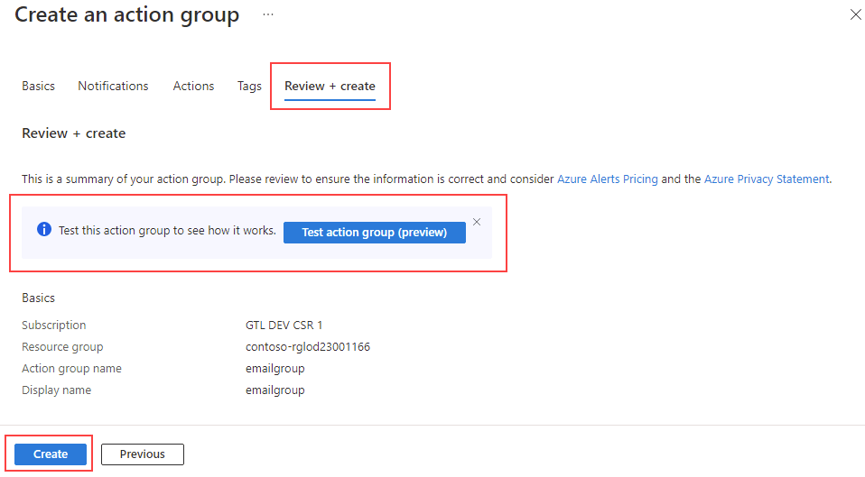
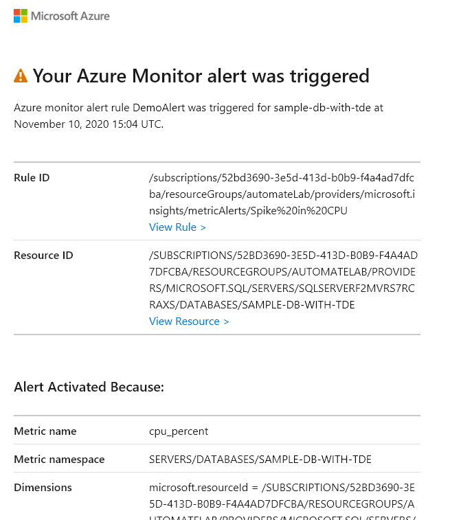

---
lab:
  title: "Laboratorio 12: creación de una alerta de estado de CPU para SQL\_Server"
  module: Automate database tasks for Azure SQL
---

# Creación de una alerta de estado de CPU para SQL Server en Azure

**Tiempo estimado: 30 minutos**

Le han contratado como ingeniero sénior de datos para que ayude a automatizar las operaciones cotidianas de administración de bases de datos. El objetivo de esta automatización es ayudarle a garantizar que las bases de datos de AdventureWorks sigan funcionando con el máximo rendimiento, así como proporcionar métodos para alertas basadas en determinados criterios.

**Nota:** Es posible que en estos ejercicios se le pida que copie y pegue código de T-SQL y que use los recursos de SQL existentes. Comprueba que el código se ha copiado correctamente antes de ejecutar el código.

## Creación de una alerta cuando una CPU excede un promedio de 80 %

1. En la barra de búsqueda de la parte superior de Azure Portal, escriba **SQL** y seleccione **Bases de datos SQL**. Selecciona el nombre de la base de datos **AdventureWorksLT** que se muestra.

    

1. En la hoja principal de la base de datos **AdventureWorksLT**, desplázate hacia abajo hasta la sección Supervisión. Seleccione **Alertas**.

    

1. Seleccione **Crear regla de alertas**.

    

1. En la diapositiva **Seleccionar una señal**, selecciona **Porcentaje de CPU**.

    

1. En la diapositiva **Configurar señal**, selecciona **Estática** para la propiedad **Umbral**. Comprueba que el **Operador** sea **Mayor que** y que el tipo de **Agregación** sea **Promedio**. A continuación, en **Valor de umbral**, escriba **80**. Seleccione **Listo**.

    

1. Seleccione la pestaña **Acciones**.

    

1. En la pestaña **Acciones**, selecciona **Crear grupo de acciones**.

    

1. En la pantalla **Grupo de acciones**, escribe **emailgroup** en el campo **Nombre del grupo de acciones** y, después, selecciona **Siguiente: notificaciones**.

    

1. En la pestaña **Notificaciones**, ingresa la siguiente información:

    - **Tipo de notificación:** correo electrónico, mensaje SMS, notificación push o mensaje de voz
        - **Nota:** al seleccionar esta opción, aparecerá un control flotante de correo electrónico, mensaje SMS, notificación push o mensaje de voz. Comprueba la propiedad Email y escribe el nombre de usuario de Azure con el que inició sesión.
    - **Nombre:** DemoLab

    

1. Seleccione **Revisar y crear** y, luego, **Crear**.

    

    **Nota:** antes de seleccionar **Crear**, también puedes seleccionar **Probar grupo de acciones (versión preliminar)** para probar la alerta.

1. Una vez creada la regla, se le envía un correo electrónico similar al siguiente a la dirección de correo electrónico que haya proporcionado.

    

    Con la alerta configurada, si el uso medio de la CPU supera el 80 %, se envía un correo electrónico como este.

    

Las alertas pueden enviarte un correo electrónico o llamar a un webhook cuando alguna métrica (por ejemplo, el tamaño de la base de datos o el uso de la CPU) alcanza el umbral definido. Acabas de ver cómo puedes configurar fácilmente alertas para bases de datos de Azure SQL.
