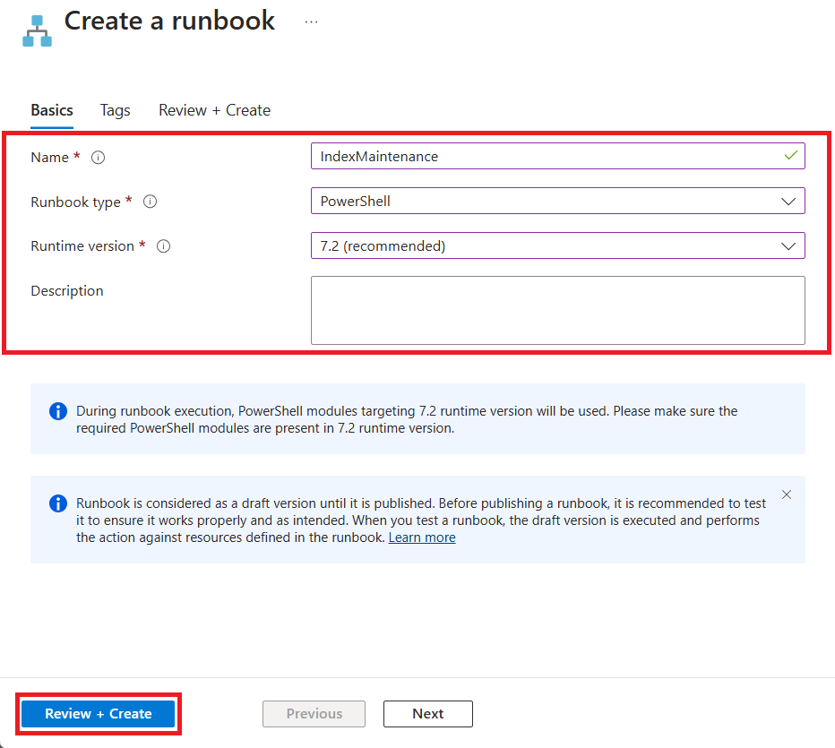

---
lab:
  title: 'Laboratorio 13: implementación de un runbook de automatización para reconstruir índices de manera automática'
  module: Automate database tasks for Azure SQL
---

# Implementación de un runbook de automatización para reconstruir índices de manera automática

**Tiempo estimado: 30 minutos**

Te han contratado como administrador sénior de bases de datos para que ayudes a automatizar las operaciones cotidianas de administración de bases de datos. El objetivo de esta automatización es ayudarle a garantizar que las bases de datos de AdventureWorks sigan funcionando con el máximo rendimiento, así como proporcionar métodos para alertas basadas en determinados criterios. AdventureWorks utiliza SQL Server en las ofertas de infraestructura como servicio (IaaS) y plataforma como servicio (PaaS).

**Nota:** En estos ejercicios se le puede pedir tanto que copie y pegue código de T-SQL como que use los recursos de SQL existentes. Comprueba que el código se ha copiado correctamente antes de ejecutar el código.

## Creación de una cuenta de Automation

1. En la máquina virtual del laboratorio, inicia una sesión del explorador y desplázate a [https://portal.azure.com](https://portal.azure.com/). Conéctate al Portal con el **Nombre de usuario** y la **Contraseña** de Azure proporcionados en la pestaña **Recursos** de esta máquina virtual de laboratorio.

    

1. En la barra de búsqueda de Azure Portal, escribe *automation*, después, selecciona **Cuentas de Automation** en los resultados de la búsqueda y, después, **+ Crear**.

    

1. En la página **Crear una cuenta de Automation**, escribe la información siguiente y, después, selecciona **Revisar y crear**.

    - **Grupo de recursos:**&lt;tu grupo de recursos&gt;
    - **Nombre:** autoAccount
    - **Ubicación:** usa la ubicación predeterminada.

    

1. En la página Revisar, seleccione **Crear**.

    

    > [!NOTE]
    > La cuenta de Automation debe crearse en unos tres minutos.

## Conexión a una instancia de Azure SQL Database

1. En Azure Portal, navega a tu base de datos buscando **sql databases**.

    

1. Selecciona la base de datos SQL **AdventureWorksLT**.

    

1. En la sección principal de la página de tu base de datos, selecciona **Editor de consultas (versión preliminar)**.

    

1. Se le pedirán las credenciales para iniciar sesión en la base de datos. Utiliza esta credencial:

    - **Inicio de sesión:** sqladmin
    - **Contraseña**: P@ssw0rd01

1. Debería recibir el siguiente mensaje de error:

    

1. Selecciona el vínculo **Permitir IP ...** proporcionado al final del mensaje de error que se muestra anteriormente. Esto agregará automáticamente la dirección IP del cliente como entrada de regla de firewall para SQL Database.

    

1. Vuelve al editor de consultas y selecciona **Aceptar** para iniciar sesión en la base de datos.

1. Abre una nueva pestaña en el explorador y desplázate a la página de GitHub para acceder al script [**AdaptativeIndexDefragmentation**](https://github.com/microsoft/tigertoolbox/blob/master/AdaptiveIndexDefrag/usp_AdaptiveIndexDefrag.sql). Después, selecciona **Sin procesar**.

    

    Esto proporcionará el código en un formato en el que puede copiarlo. Seleccione todo el texto (<kbd>CTRL</kbd> + <kbd>A</kbd>) y cópielo en el portapapeles (<kbd>CTRL</kbd> + <kbd>C</kbd>).

    >[!NOTE]
    > La finalidad de este script es realizar una desfragmentación inteligente en uno o varios índices, así como la actualización de estadísticas necesaria, para una o varias bases de datos.

1. Cierre la pestaña del explorador de GitHub y vuelva a Azure Portal.

1. Pega el texto que copiaste en el panel **Consulta 1**.

    

1. Elimine `USE msdb` y `GO` en las líneas 5 y 6 de la consulta (que se resaltan en la captura de pantalla) y seleccione **Ejecutar**.

1. Expanda la carpeta **Procedimientos almacenados** para ver lo que se ha creado.

    

## Configuración de recursos de cuenta de automatización

Los pasos siguientes consisten en configurar los recursos necesarios para preparar la creación del runbook. Después, seleccione **Cuentas de Automation**.

1. En Azure Portal, en el cuadro de búsqueda superior, escriba **Automation**.

    

1. Seleccione la cuenta de Automation que acaba de crear.

    

1. Selecciona **Módulos** en la sección **Recursos compartidos** de la hoja de Automation. Después, selecciona **Explorar la galería**.

    

1. Busque **sqlserver** dentro de la galería.

    

1. Selecciona **SqlServer**, se te dirigirá a la pantalla siguiente y, después, selecciona **Seleccionar**.

    

1. En la página **Agregar un módulo**, selecciona la versión del entorno de ejecución más reciente disponible y después, **Importar**. Esto importará el módulo de PowerShell en la cuenta de Automation.

    

1. Deberá crear una credencial para iniciar sesión de forma segura en la base de datos. En la hoja de la cuenta de Automation, vaya a la sección **Recursos compartidos** y seleccione **Credenciales**.

    

1. Selecciona **+ Agregar una credencial**, escribe la información siguiente y después selecciona **Crear**.

    - Nombre: **SQLUser**
    - Nombre de usuario: **sqladmin**
    - Contraseña: **P@ssw0rd01**
    - Confirmar contraseña: **P@ssw0rd01**

    

## Creación de un runbook de PowerShell

1. En Azure Portal, navega a tu base de datos buscando **sql databases**.

    

1. Selecciona la base de datos SQL **AdventureWorksLT**.

    

1. En la página **Información general**, copia el **Nombre del servidor** de Azure SQL Database tal y como se muestra a continuación (el nombre del servidor debe empezar por *dp300-lab*). La pegará en los pasos posteriores.

    

1. En Azure Portal, en el cuadro de búsqueda superior, escriba **Automation**.

    

1. Seleccione la cuenta de Automation que acaba de crear.

    

1. Desplázate hasta la sección **Automatización de procesos** de la hoja de la cuenta de Automation, selecciona **Runbooks** y, después, **+ Crear un runbook**.

    

    >[!NOTE]
    > Como hemos aprendido, ten en cuenta que hay dos runbooks existentes creados. Estos se crearon automáticamente durante la implementación de la cuenta de Automation.

1. Escriba el nombre del runbook como **IndexMaintenance** y un tipo de runbook de **PowerShell**. Selecciona la versión del entorno de ejecución más reciente disponible y después selecciona **Crear**.

    

1. Una vez creado el runbook, copia y pega el fragmento de código de PowerShell siguiente en el editor de runbook. En la primera línea del script, pega el nombre del servidor que copiaste en los pasos anteriores. Seleccione **Guardar** y, a continuación, **Publicar**.

    **Nota:** comprueba que el código se ha copiado correctamente antes de guardar el runbook.

    ```powershell
    $AzureSQLServerName = ''
    $DatabaseName = 'AdventureWorksLT'
    
    $Cred = Get-AutomationPSCredential -Name "SQLUser"
    $SQLOutput = $(Invoke-Sqlcmd -ServerInstance $AzureSQLServerName -UserName $Cred.UserName -Password $Cred.GetNetworkCredential().Password -Database $DatabaseName -Query "EXEC dbo.usp_AdaptiveIndexDefrag" -Verbose) 4>&1

    Write-Output $SQLOutput
    ```

    

1. Si todo va bien, deberías recibir un mensaje correcto.

    

## Creación de una programación para un runbook

A continuación, programará el runbook para que se ejecute de forma periódica.

1. En **Recursos**, en el panel de navegación izquierdo del runbook **IndexMaintenance**, selecciona **Programaciones**. A continuación, seleccione **+ Agregar una programación**.

    

1. Seleccione **Vincular una programación a su Runbook**.

    

1. Selecciona **+ Agregar una programación**.

    

1. Proporcione un nombre descriptivo para la programación y una descripción, si lo quiere.

1. Especifica la hora de inicio a las **4:00 a. m.** del día siguiente en la zona horaria **Hora del Pacífico**. Configure la periodicidad para cada **1** día. No establezca una expiración.

    

1. Seleccione **Crear** y después seleccione **Aceptar**.

1. La programación se ha creado y ahora está vinculada al runbook. Seleccione **Aceptar**.

    

Azure Automation ofrece un servicio de automatización y configuración basado en la nube que admite una administración coherente en los entornos de Azure y que no son de Azure.

Al completar este ejercicio, has automatizado la desfragmentación de los índices en una base de datos de SQL Server para que se ejecute cada día, a las 4:00 a. m.