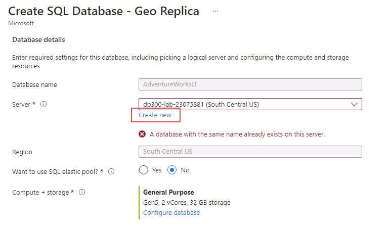

---
lab:
  title: 'Laboratorio 14: configuración de la replicación geográfica para Azure SQL Database'
  module: Plan and implement a high availability and disaster recovery solution
---

# Configuración de la replicación geográfica para Azure SQL Database

**Tiempo estimado: 30 minutos**

Como DBA en AdventureWorks, debes habilitar la replicación geográfica para Azure SQL Database y asegurarte de que funciona correctamente. Además, conmutarás por error manualmente a otra región mediante el portal.

**Nota:** Es posible que en estos ejercicios se le pida que copie y pegue código de T-SQL y que use los recursos de SQL existentes. Comprueba que el código se ha copiado correctamente antes de ejecutar el código.

## Habilitación de la replicación geográfica

1. En la máquina virtual del laboratorio, inicia una sesión del explorador y desplázate a [https://portal.azure.com](https://portal.azure.com/). Conéctate al Portal con el **Nombre de usuario** y la **Contraseña** de Azure proporcionados en la pestaña **Recursos** de esta máquina virtual de laboratorio.

    

1. En Azure Portal, navega a tu base de datos buscando **sql databases**.

    

1. Selecciona la base de datos SQL **AdventureWorksLT**.

    

1. En la hoja de la base de datos, en la sección **Administración de datos**, selecciona **Réplicas**.

    

1. Selecciona **+ Crear réplica**.

    

1. En la página **Crear base de datos SQL - Réplica geográfica** y en **Servidor** selecciona el vínculo **Crear nuevo**.

    

    >[!NOTE]
    > Puesto que estamos creando un nuevo servidor para hospedar nuestra base de datos secundaria, podemos ignorar el mensaje de error anterior.

1. En la página **Crear servidor de SQL Database**, escribe un **nombre de servidor** único de tu preferencia, un **inicio de sesión de administrador de servidor** válido y una **contraseña** segura. Selecciona una **ubicación** como región de destino y después selecciona **Aceptar** para crear el servidor.

    

1. De nuevo en la página **Crear base de datos SQL - Réplica geográfica**, selecciona **Revisar y crear**.

    

1. Seleccione **Crear**.

    

1. A continuación, se crearán el servidor secundario y la base de datos. Para comprobar el estado, mira debajo del icono de notificación en la parte superior del portal. 

    

1. Si la operación se realiza correctamente, el estado **Implementación en curso** pasará a **La implementación se realizó correctamente**.

    

## Conmutación por error de base de datos SQL a una región secundaria

Ahora que se ha creado la réplica de Azure SQL Database, realizará una conmutación por error.

1. Desplázate a la página de servidores SQL y observa el nuevo servidor en la lista. Selecciona el servidor secundario (puedes tener un nombre de servidor diferente).

    

1. En la hoja del servidor SQL, en la sección **Configuración**, haz clic en **Bases de datos SQL**.

    

1. En la hoja principal de la base de datos SQL, en la sección **Administración de datos**, selecciona **Réplicas**.

    

1. Ten en cuenta que ahora se ha establecido el vínculo de replicación geográfica.

    

1. Selecciona el menú **...** del servidor secundario y selecciona **Conmutación por error forzada**.

    

    > [!NOTE]
    > La conmutación por error forzada cambiará la base de datos secundaria al rol principal. Todas las sesiones se desconectan durante esta operación.

1. Cuando te lo solicite el mensaje de advertencia, haz clic en **Sí**.

    

1. El estado de la réplica principal cambiará a **Pendiente** y la secundaria a **Conmutación por error**. 

    

    > [!NOTE]
    > El proceso puede tardar unos minutos. Cuando hayas finalizado, los roles cambiarán y el secundario será el nuevo principal y el antiguo principal será el secundario.

Hemos visto que la base de datos secundaria legible puede estar en la misma región de Azure que la principal o, lo que es más común, en otra región. Este tipo de bases de datos secundarias legibles también se conocen como geográficas secundarias o réplicas geográficas.

Ahora ya sabes cómo habilitar la replicación geográfica para Azure SQL Database y conmutarla por error manualmente a otra región mediante el portal.
