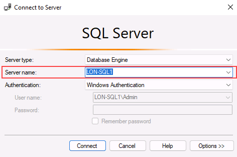
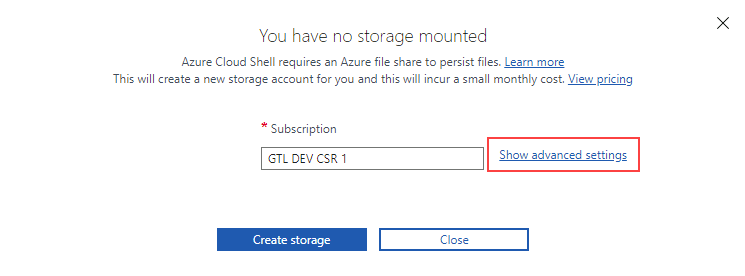
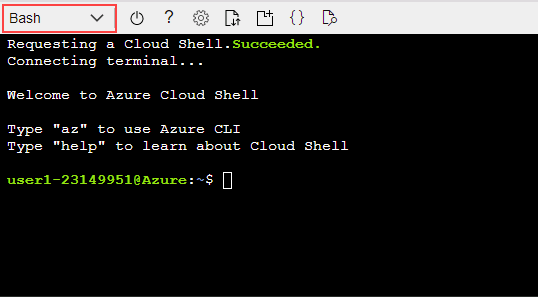
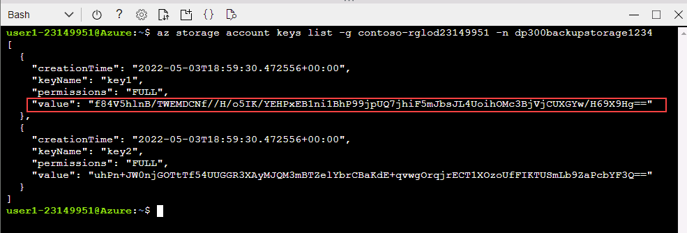
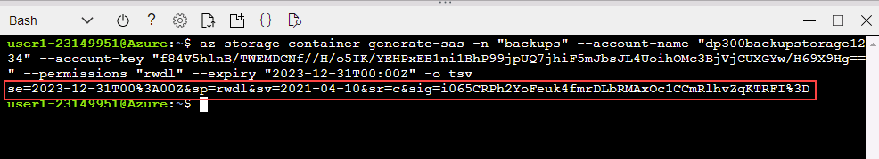
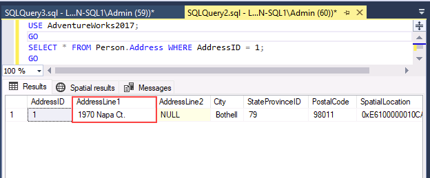

---
lab:
  title: 'Laboratorio 15: Realización de una copia de seguridad en URL y restaurar desde URL'
  module: Plan and implement a high availability and disaster recovery solution
---

# Copia de seguridad en URL

**Tiempo estimado: 30 minutos**

Como administrador de bases de datos de AdventureWorks, debes realizar una copia de seguridad de una base de datos en una dirección URL en Azure y restaurarla desde Azure Blob Storage después de que se haya producido un error humano.

## Restaurar una base de datos

1. Descarga el archivo de copia de seguridad de la base de datos ubicado en **https://github.com/MicrosoftLearning/dp-300-database-administrator/blob/master/Instructions/Templates/AdventureWorks2017.bak** en **C:\LabFiles\Monitor** y optimiza la ruta de acceso en la máquina virtual del laboratorio (crea la estructura de carpetas si no existe).

    

1. Selecciona el botón Inicio de Windows y escribe SSMS. Selecciona **Microsoft SQL Server Management Studio 18** en la lista.  

    

1. Cuando se abra SSMS, observa que el cuadro de diálogo **Conectar con el servidor** se rellenará previamente con el nombre de la instancia predeterminado. Selecciona **Conectar**.

    

1. Selecciona la carpeta **Bases de datos** y después **Nueva consulta**.

    

1. En la ventana Nueva consulta, copia y pega la consulta de T-SQL siguiente. Ejecuta la consulta para restaurar la base de datos.

    ```sql
    RESTORE DATABASE AdventureWorks2017
    FROM DISK = 'C:\LabFiles\HADR\AdventureWorks2017.bak'
    WITH RECOVERY,
          MOVE 'AdventureWorks2017' 
            TO 'C:\LabFiles\HADR\AdventureWorks2017.mdf',
          MOVE 'AdventureWorks2017_log'
            TO 'C:\LabFiles\HADR\AdventureWorks2017_log.ldf';
    ```

    **Nota:** el nombre y la ruta de acceso del archivo de copia de seguridad de la base de datos deben coincidir con lo descargado en el paso 1; de lo contrario, se producirá un error en el comando.

1. Debería aparecer un mensaje de operación correcta una vez completada la restauración.

    

## Configuración de la copia de seguridad en una dirección URL

1. En la máquina virtual del laboratorio, inicia una sesión del explorador y desplázate a [https://portal.azure.com](https://portal.azure.com/). Conéctate al Portal con el **Nombre de usuario** y la **Contraseña** de Azure proporcionados en la pestaña **Recursos** de esta máquina virtual de laboratorio.

    

1. Abre una solicitud de **Cloud Shell** seleccionando el icono que se muestra a continuación.

    

1. Si aún no has usado Cloud Shell, en la mitad inferior del portal podrás ver un mensaje que te da la bienvenida a Azure Cloud Shell. Selecciona **Bash**.

    

1. Si no has usado previamente Cloud Shell, debes configurar un almacenamiento. Selecciona **Mostrar configuración avanzada** (puedes tener una suscripción diferente asignada).

    

1. Usa el **Grupo de recursos** existente y especifica nuevos nombres para la **Cuenta de almacenamiento** y el **Recurso compartido de archivos**, tal y como se muestra en el siguiente cuadro de diálogo. Toma nota del nombre del **grupo de recursos**. Deberías empezar con *contoso-rg*. Después, selecciona **Crear almacenamiento**.

    **Nota:** el nombre de la cuenta de almacenamiento debe ser único y todo en minúsculas, sin caracteres especiales. Especifica un nombre único.

    

1. Una vez que haya finalizado, verás un mensaje similar al siguiente. Comprueba que la esquina superior izquierda de la pantalla de Cloud Shell muestra **Bash**.

    

1. Crea una nueva cuenta de almacenamiento desde la CLI mediante la ejecución del siguiente comando en Cloud Shell. Usa el nombre del grupo de recursos que comienza por **contoso-rg** y que anotaste anteriormente.

    > [!NOTE]
    > Cambia el nombre del grupo de recursos (parámetro **-g**) y proporciona un nombre de cuenta de almacenamiento único (parámetro **-n**).

    ```bash
    az storage account create -n "dp300backupstorage1234" -g "contoso-rglod23149951" --kind StorageV2 -l eastus2
    ```

    

1. A continuación, obtendrás las claves de la cuenta de almacenamiento, que deberás usar en los pasos siguientes. Ejecuta el código siguiente en Cloud Shell mediante el nombre único de la cuenta de almacenamiento y grupo de recursos.

    ```bash
    az storage account keys list -g contoso-rglod23149951 -n dp300backupstorage1234
    ```

    La clave de cuenta se mostrará en los resultados del comando anterior. Asegúrate de usar el mismo nombre (después de **-n**) y el grupo de recursos (después de **-g**) que usaste en el comando anterior. Copie el valor devuelto para **Key1** (sin las comillas dobles), tal como se muestra aquí:

    

1. La copia de seguridad de una base de datos de SQL Server en una dirección URL usa una cuenta de almacenamiento y un contenedor dentro de ella. En este paso, crearás un contenedor específicamente para el almacenamiento de copia de seguridad. Para ello, ejecuta los comandos siguientes.

    ```bash
    az storage container create --name "backups" --account-name "dp300backupstorage1234" --account-key "storage_key" --fail-on-exist
    ```

    Donde **dp300backupstorage1234** es el nombre de la cuenta de almacenamiento único que usaste al crearla y **storage_key** es la clave generada anteriormente. La salida debe devolver el valor **true**.

    

1. Para comprobar que las copias de seguridad del contenedor se han creado correctamente, ejecuta:

    ```bash
    az storage container list --account-name "dp300backupstorage1234" --account-key "storage_key"
    ```

    Donde **dp300backupstorage1234** es el nombre de la cuenta de almacenamiento única que usaste al crearla y **storage_key** es la clave generada. La salida debe devolver algo parecido a lo siguiente:

    

1. Por seguridad, es necesario tener una Firma de acceso compartido (SAS) en el nivel de contenedor. Esto puede realizarse a través de Cloud Shell o PowerShell. Ejecuta lo siguiente:

    ```bash
    az storage container generate-sas -n "backups" --account-name "dp300backupstorage1234" --account-key "storage_key" --permissions "rwdl" --expiry "date_in_the_future" -o tsv
    ```

    Donde **dp300backstoragestorage1234** es el nombre de la cuenta de almacenamiento único que usaste al crearla y **storage_key** es la clave generada y **date_in_the_future** es una hora posterior a la de ahora. **date_in_the_future** debe estar en formato UTC. Un ejemplo es **2021-12-31T00:00Z**, que indica que la fecha de expiración es la medianoche del 31 de diciembre de 2020.

    La salida debe devolver algo parecido a lo siguiente. Copia toda la firma de acceso compartido y pégala en el **Bloc de notas**, ya que la usarás en la siguiente tarea.

    

## Crear una credencial

Ahora que la funcionalidad ya está configurada, puedes generar un archivo de copia de seguridad como un blob en la cuenta de Azure Storage.

1. Inicia **SQL Server Management Studio (SSMS)**.

1. Se te pedirá que te conectes a SQL Server. Asegúrate de que la opción **Autenticación de Windows** esté seleccionada y, a continuación, selecciona **Conectar**.

1. Selecciona **Nueva consulta**.

1. Crea la credencial que se usará para obtener acceso al almacenamiento en la nube con el siguiente código de Transact-SQL. Rellena los valores adecuados y selecciona **Ejecutar**.

    ```sql
    IF NOT EXISTS  
    (SELECT * 
        FROM sys.credentials  
        WHERE name = 'https://<storage_account_name>.blob.core.windows.net/backups')  
    BEGIN
        CREATE CREDENTIAL [https://<storage_account_name>.blob.core.windows.net/backups]
        WITH IDENTITY = 'SHARED ACCESS SIGNATURE',
        SECRET = '<key_value>'
    END;
    GO  
    ```

    Ambos resultados de **<storage_account_name>** son el nombre de la cuenta de almacenamiento único creada anteriormente y **<key_value>** es el valor generado al final de la tarea anterior en este formato:

    `'se=2020-12-31T00%3A00Z&sp=rwdl&sv=2018-11-09&sr=csig=rnoGlveGql7ILhziyKYUPBq5ltGc/pzqOCNX5rrLdRQ%3D'`

1. Puedes comprobar si la credencial se creó correctamente; para ello, ve a **Seguridad -> Credenciales** en el explorador de objetos.

    

1. Si no has escrito bien algún dato y necesitas volver a crear la credencial, puedes quitarla con el siguiente comando, pero asegúrate de cambiar el nombre de la cuenta de almacenamiento:

    ```sql
    -- Only run this command if you need to go back and recreate the credential! 
    DROP CREDENTIAL [https://<storage_account_name>.blob.core.windows.net/backups]  
    ```

## Copia de seguridad en URL

1. Realiza una copia de seguridad de la base de datos **AdventureWorks2017** en Azure con el siguiente comando en Transact-SQL:

    ```sql
    BACKUP DATABASE AdventureWorks2017   
    TO URL = 'https://<storage_account_name>.blob.core.windows.net/backups/AdventureWorks2017.bak';
    GO 
    ```

    Donde **<storage_account_name>** es el nombre de la cuenta de almacenamiento único que se usó para crearla. La salida debe devolver algo parecido a lo siguiente.

    

    Si algo se configuró incorrectamente, verás un mensaje de error similar al siguiente:

    

    Si se produce un error, comprueba que no escribiste incorrectamente nada al crear la credencial y que todo se haya creado correctamente.

## Validación de la copia de seguridad mediante la CLI de Azure

Para ver si el archivo se encuentra realmente en Azure, puedes usar Explorador de Storage (versión preliminar) o Azure Cloud Shell.

1. Inicia un explorador web y ve a [https://portal.azure.com](https://portal.azure.com/). Conéctate al Portal con el **Nombre de usuario** y la **Contraseña** de Azure proporcionados en la pestaña **Recursos** de esta máquina virtual de laboratorio.

1. Usa Azure Cloud Shell para ejecutar el siguiente comando de la CLI de Azure:

    ```bash
    az storage blob list -c "backups" --account-name "dp300backupstorage1234" --account-key "storage_key" --output table
    ```

    Asegúrate de usar el mismo nombre de cuenta de almacenamiento único (después de **--account-name**) y la clave de cuenta (después de **--account-key**) que usaste en los comandos anteriores.

    

    Podemos confirmar que el archivo de copia de seguridad se generó correctamente.

## Validación de la copia de seguridad con Explorador de Storage

1. Para usar el Explorador de Storage (versión preliminar), ve a la Página principal de Azure Portal y selecciona **Cuentas de almacenamiento**.

    

1. Selecciona el nombre de la cuenta de almacenamiento único que creaste para las copias de seguridad.

1. En el panel de navegación izquierdo, selecciona **Explorador de Storage (versión preliminar)**. Expande **Contenedores de blobs**.

    

1. Selecciona **Copias de seguridad**.

    

1. Ten en cuenta que el archivo de copia de seguridad se almacena en el contenedor.

    

## Restauración desde URL

En esta tarea te mostraremos cómo restaurar una base de datos desde Azure Blob Storage.

1. En **SQL Server Management Studio (SSMS),** selecciona **Nueva consulta** y pega y ejecuta la consulta siguiente.

    ```sql
    USE AdventureWorks2017;
    GO
    SELECT * FROM Person.Address WHERE AddressId = 1;
    GO
    ```

    

1. Ejecuta este comando para cambiar el nombre de ese cliente.

    ```sql
    UPDATE Person.Address
    SET AddressLine1 = 'This is a human error'
    WHERE AddressId = 1;
    GO
    ```

1. Vuelve a ejecutar el **paso 1** para comprobar que se haya cambiado la dirección. Ahora, imagina que alguien ha cambiado miles o millones de filas sin una cláusula WHERE, o bien mediante la cláusula WHERE equivocada. Una de las soluciones implica restaurar la base de datos a partir de la última copia de seguridad disponible.

    

1. Para restaurar la base de datos y volver a un punto anterior al cambio del nombre del cliente por error, ejecuta lo siguiente.

    **Nota:** la sintaxis **SET SINGLE_USER WITH ROLLBACK IMMEDIATE** para revertir todas las transacciones abiertas. Esto puede impedir que se produzca un error en la restauración debido a conexiones activas.

    ```sql
    USE [master]
    GO

    ALTER DATABASE AdventureWorks2017 SET SINGLE_USER WITH ROLLBACK IMMEDIATE
    GO

    RESTORE DATABASE AdventureWorks2017 
    FROM URL = 'https://<storage_account_name>.blob.core.windows.net/backups/AdventureWorks2017.bak'
    GO

    ALTER DATABASE AdventureWorks2017 SET MULTI_USER
    GO
    ```

    Donde **<storage_account_name>** es el nombre de cuenta de almacenamiento único que creaste.

    La salida debería ser similar a esta:

    

1. Vuelve a ejecutar el **paso 1** para comprobar que se ha restaurado el nombre del cliente.

    

Es importante entender los componentes y la interacción entre ellos para realizar una copia de seguridad o una restauración desde el servicio Azure Blob Storage.

Ahora ya puedes realizar la copia de seguridad de una base de datos en una dirección URL de Azure y, si es necesario, restaurarla.
